# 系统设计文档

## 1. 开发环境和工具

### 1.1 开发环境

- 硬件平台：x86_64 PC，$\ge 16GB$ RAM。
- 操作系统：Windows 11 64-bit。
- 编译环境：MSVC 17.14.15（VS 2022），CMake 3.28+，vcpkg manifest 模式，Ninja/VS 生成器，PowerShell 7。
- IDE：CLion 2025.3.1，Visual Studio 2022，Qt Creator。
- 版本控制：Git。

### 1.2 依赖库

- Qt 6（本机安装的 MSVC x64 版本，用于 GUI）。
- libarchive（tar/zip 读写），SQLite3（元数据存储），OpenSSL（可选，7z AES）。
- 7-Zip：third_party/7-Zip 中预构建的 7z.dll、7-zip.dll、7z.exe；若缺失可用 third_party/p7zip 源码回退。
- GoogleTest（单元测试）。

## 2. 总体设计

### 2.1 系统结构设计

#### 2.1.1 顶层系统结构

- 主要组件：`backup_suite_core`(DLL)、`backup_suite_cli`、`backup_suite_gui`、`core_tests`、`third_party`。
- 交互：CLI/GUI 通过`core`统一调用设备与备份控制器；`core`运行期加载`7-Zip`相关二进制；`tests`复用`core`。

##### 2.1.1.1 构件图

`core`模块向上提供API，CLI/GUI均动态链接`core`；`core`依赖`libarchive`/`SQLite`/`7-Zip`；`tests`动态链接`core`与`gtest`。


##### 2.1.1.2 构件图描述

- `utils`: 工具类集合，包括字节序转换、CRC32计算、临时文件管理和读写zip、tar、7z等文件的类。
- `encryption`: 包括了所有实现了的加密算法，这里包括*ZipCrypto*和*RC4*两种（用于zip）。
- `filesystem`: 抽象备份设备的接口和具体实现类，包括对本地文件系统、tar、zip、7z等格式的支持。
- `backup_controller`: 负责备份和恢复的核心逻辑，协调源设备和目标设备之间的数据传输。
- `cli`：命令行界面，解析用户输入的参数，调用 core 进行备份或恢复操作。
- `gui`：图形用户界面，基于 Qt 实现，提供用户友好的交互界面。
- `tests`：单元测试模块，使用 GoogleTest 框架，验证核心功能的正确性。

### 2.2 核心模块结构（core）

这部分提供了备份软件的核心功能模块，包括了一个抽象的设备接口（Device）和多个具体的设备实现类（`SystemDevice`、`TarDevice`、`ZipDevice`、`SevenZipDevice`），以及负责备份和恢复操作的控制器（`BackupController`）。此外，还包含了一些辅助类，如`FileEntity`和`Folder`，用于表示文件和目录的元数据，以及`Database`类，用于管理***SQLite***数据库索引。

### 2.3 测试模块结构（tests）

这部分包含了针对核心模块的单元测试，使用***GoogleTest***框架来验证各个类和方法的正确性。测试模块主要测试`core`模块的功能，确保其实现正确。

### 2.4 命令行界面模块结构（cli）

命令行界面模块负责解析用户通过命令行输入的参数，并调用核心模块的功能来执行备份或恢复操作。它提供了一个简单的接口，允许用户指定源和目标设备，以及其他配置选项。

## 3. 静态建模

### 3.1 系统对象模型

在本项目中，由于我们引入了HAL层（代码中没有直接体现，实际上对应`core/filesystem`中的代码），我们可以将整个系统根据其在HAL层的上方还是下方分成三个部分——HAL层、底层实现（南向）和上层应用（北向）。之后我们会根据这个顺序来描述系统对象模型。

### 3.2 HAL层对象

在HAL层（`core/filesystem`）中，我们为了抚平不同设备之间文件属性、文件读取方式的差异，同时为了兼容*Linux*和*Windows*文件系统，设计了一个中间表示层，主要包括：

- 一个统一的文件元数据表示`FileEntityMeta`，其中包括了*Linux*文件和*Windows*文件常见属性的并集；
- 一个统一的文件表示`FileEntity`以及其派生出的文件夹表示`Folder`、可读文件表示`ReadableFile`；
- 一个统一的设备接口`Device`，定义了基本的查找文件、读写文件接口。

#### 3.2.1 文件元数据表示

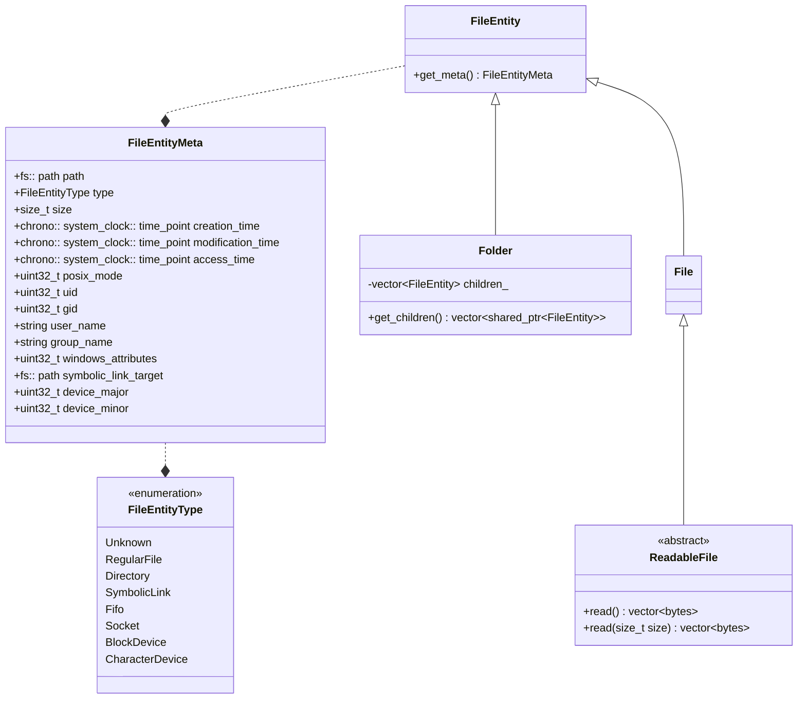
```mermaid
classDiagram
    class FileEntityType {
        <<enumeration>>
        Unknown
        RegularFile
        Directory
        SymbolicLink
        Fifo
        Socket
        BlockDevice
        CharacterDevice
    }
    class FileEntityMeta {
        +fs:: path path
        +FileEntityType type
        +size_t size
        +chrono:: system_clock:: time_point creation_time
        +chrono:: system_clock:: time_point modification_time
        +chrono:: system_clock:: time_point access_time
        +uint32_t posix_mode
        +uint32_t uid
        +uint32_t gid
        +string user_name
        +string group_name
        +uint32_t windows_attributes
        +fs:: path symbolic_link_target
        +uint32_t device_major
        +uint32_t device_minor
    }
    class FileEntity {
        +get_meta() FileEntityMeta
    }
    class Folder {
        -vector~FileEntity~ children_
        +get_children() vector~shared_ptr~FileEntity~~
    }
    class ReadableFile {
        <<abstract>>
        +read() vector~bytes~
        +read(size_t size) vector~bytes~
    }
    FileEntityMeta ..* FileEntityType
    FileEntity ..* FileEntityMeta
    FileEntity <|-- File
    File <|-- ReadableFile
    FileEntity <|-- Folder
```

在我们的文件元数据统一表示中，我们支持了*Linux*中可能出现的8种文件，虽然实际上我们几乎只会和普通文件、目录和符号链接打交道。具体的，我们的文件元数据统一表示取了*Linux*和*Windows*文件属性的并集，包括了所有文件系统中的文件所共有的文件路径、文件类型、文件大小和创建时间、修改时间、访问时间（Linux中没有创建时间）等基本属性；同时也包括了*Linux*中特有的POSIX权限、用户ID、组ID、用户名、组名等属性，以及*Windows*中特有的文件属性（如只读、隐藏等）。此外，我们还考虑到了符号链接和设备文件的特殊属性，分别用`symbolic_link_target`和`device_major`/`device_minor`来表示。

此外，我们在抽象层表示上还定义了`Folder`描述文件夹，`ReadableFile`描述可读文件，这两个类都继承自`FileEntity`。其中`Folder`拥有`get_children`方法来获取目录下所有文件；`ReadableFile`提供了`read`方法实现一次性读。

#### 3.2.2 设备接口

在设备的统一表示中，我们定义了一个抽象的`Device`接口，包含了文件存在性检查、获取文件元数据、获取可读文件、获取文件夹以及写入文件和文件夹等基本操作。这样，不同类型的设备（如本地文件系统、tar归档、zip归档、7z归档等）都可以通过实现这个接口来提供统一的访问方式。

### 3.3 南向设备实现

这部分主要包括`SystemDevice`、`TarDevice`、`ZipDevice`和`SevenZipDevice`四个具体的设备实现类，它们都继承自`Device`接口，并实现了其中定义的各种方法。每个设备类都根据其特定的存储格式和访问方式来实现这些方法，从而提供对不同类型存储介质的统一访问。

由于篇幅有限，这里仅描述与这些设备实现**直接相关**的类与其中具体的实现细节。

#### 3.3.1 系统设备实现

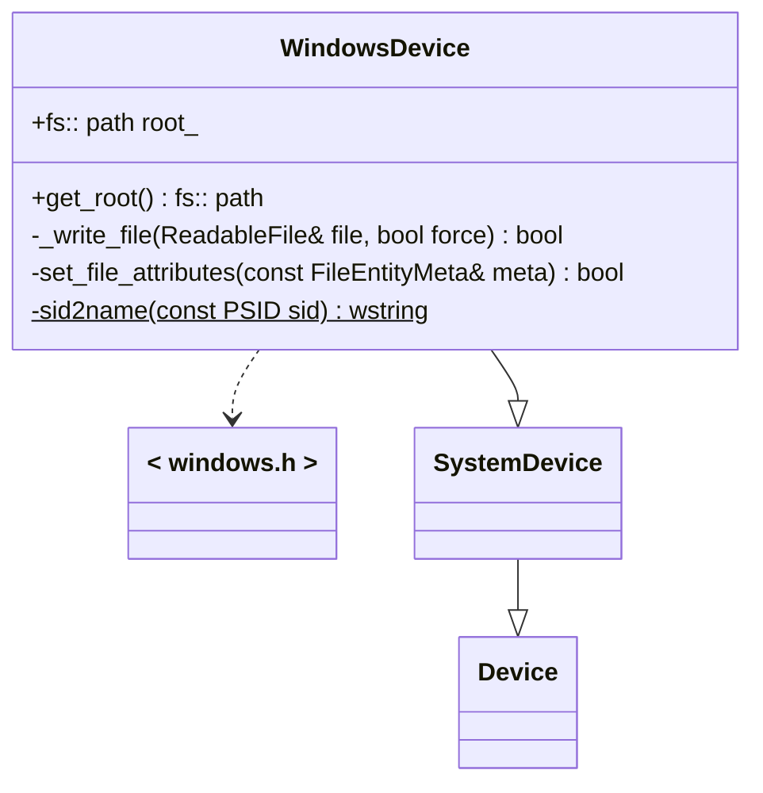
```mermaid
classDiagram
    class WindowsDevice {
        +fs:: path root_
        +get_root() fs:: path
        -_write_file(ReadableFile& file, bool force) bool
        -set_file_attributes(const FileEntityMeta& meta) bool
        -sid2name(const PSID sid) wstring$
    }
    class windows["< windows.h >"]
    WindowsDevice --|> SystemDevice
    SystemDevice --|> Device
    WindowsDevice ..> windows
```

- `unique_ptr<Folder> get_folder(const fs::path&path, bool recursion=false)`: 通过***Windows API***遍历目录并构造`Folder`对象。
- `unique_ptr<ReadableFile> get_file(const fs::path&path)`: 通过`ifstream`打开文件流并封装为`PhysicalDeviceReadableFile`。
- `unique_ptr<ifstream> get_file_stream(const fs::path& path)`: 返回文件流`ifstream`对象。
- `unique_ptr<FileEntityMeta> get_meta(const fs::path& path)`: 通过 Windows API 获取文件属性并转换为`FileEntityMeta`，`get_meta`支持获取普通文件、目录和符号链接的元数据，并支持获取符号链接指向的路径、获取文件属性。*Windows*的文件权限管理与*Linux*不同，其控制逻辑更加复杂，这里我们只简单地获取了文件的所有者SID，并通过`sid2name`方法将其转换为用户名。
- `bool exists(const fs::path& path)`: 通过***Windows API***检查文件或目录是否存在。
- `bool _write_file(ReadableFile& file, bool force)`: 将`ReadableFile`内容写入本地文件系统，支持覆盖写入，会自动根据文件元数据的统一表示设置文件属性。
- `bool write_folder(Folder& folder)`: 创建目录本身（并不会递归创建子文件）。
- `bool set_file_attributes(const FileEntityMeta& meta)`: 利用***Windows API***根据`FileEntityMeta`设置文件属性，包括创建、修改、访问时间及只读、隐藏属性等。

#### 3.3.2 Tar 设备实现

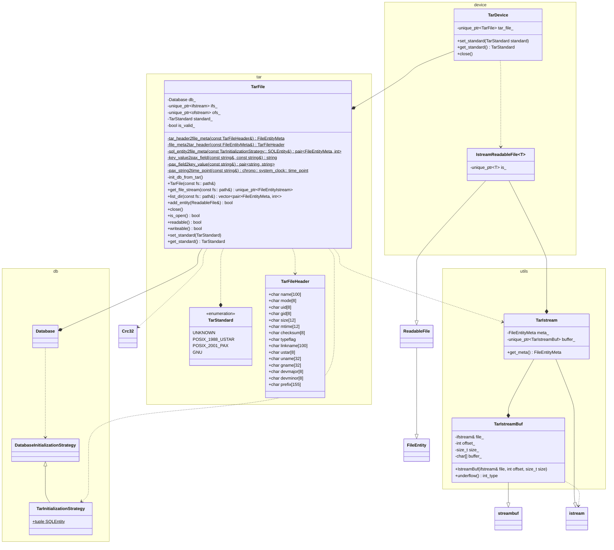
```mermaid
classDiagram
    namespace db {
        class Database
        class DatabaseInitializationStrategy
        class TarInitializationStrategy {
            +tuple SQLEntity$
        }
    }
    namespace tar {
        class TarStandard {
            <<enumeration>>
            UNKNOWN
            POSIX_1988_USTAR
            POSIX_2001_PAX
            GNU
        }
        class TarFileHeader {
            +char name[100]
            +char mode[8]
            +char uid[8]
            +char gid[8]
            +char size[12]
            +char mtime[12]
            +char checksum[8]
            +char typeflag
            +char linkname[100]
            +char ustar[8]
            +char uname[32]
            +char gname[32]
            +char devmajor[8]
            +char devminor[8]
            +char prefix[155]
        }
        class TarFile {
            -Database db_
            -unique_ptr~ifstream~ ifs_
            -unique_ptr~ofstream~ ofs_
            -TarStandard standard_
            -bool is_valid_
            -tar_header2file_meta(const TarFileHeader&) FileEntityMeta$
            -file_meta2tar_header(const FileEntityMeta&) TarFileHeader$
            -sql_entity2file_meta(const TarInitializationStrategy:: SQLEntity&) pair~FileEntityMeta, int~$
            -key_value2pax_field(const string&, const string&) string$
            -pax_field2key_value(const string&) pair~string, string~$
            -pax_string2time_point(const string&) chrono:: system_clock:: time_point$
            -init_db_from_tar()
            +TarFile(const fs:: path&)
            +get_file_stream(const fs:: path&) unique_ptr~FileEntityIstream~
            +list_dir(const fs:: path&) vector~pair~FileEntityMeta, int~~
            +add_entity(ReadableFile&) bool
            +close()
            +is_open() bool
            +readable() bool
            +writeable() bool
            +set_standard(TarStandard)
            +get_standard() TarStandard
        }
    }
    namespace utils {
        class TarIstreamBuf {
            -ifstream& file_
            -int offset_
            -size_t size_
            -char[] buffer_
            +IstreamBuf(ifstream& file, int offset, size_t size)
            +underflow() int_type
        }
        class TarIstream {
            -FileEntityMeta meta_
            -unique_ptr~TarIstreamBuf~ buffer_
            +get_meta() FileEntityMeta
        }
    }
    namespace device {
        class IstreamReadableFile~T~ {
            -unique_ptr~T~ is_
        }
        class TarDevice {
            -unique_ptr~TarFile~ tar_file_
            +set_standard(TarStandard standard)
            +get_standard() TarStandard
            +close()
        }
    }
    DatabaseInitializationStrategy <|-- TarInitializationStrategy
    Database ..> DatabaseInitializationStrategy
    TarIstream --* TarIstreamBuf
    TarIstreamBuf --|> streambuf
    TarIstream --|> istream
    TarIstreamBuf ..> istream
    TarFile ..> TarFileHeader
    TarFile ..* TarStandard
    TarFile ..> TarIstream
    TarFile --* Database
    TarFile ..> TarInitializationStrategy
    TarFile ..> Crc32
    TarDevice --* TarFile
    IstreamReadableFile~T~ --|> ReadableFile
    ReadableFile --|> FileEntity
    TarDevice ..> IstreamReadableFile~TarIstream~
    IstreamReadableFile~TarIstream~ --* TarIstream
```

这里简单介绍一下Tar文件的标准。根据***POSIX.1-1988***（**ustar**），Tar文件以512字节为一块组织文件，块分为**头块**和**数据块**两种，对应代码中的`union TarBlock{TarFileHeader header; char block[512]}`。头块中各字段的偏移和大小见`TarFileHeader`，其中使用`char`而不是`uint8_t`或`std::byte`是因为Tar标准规定使用**字符串**来表示数据。可以发现原始的Tar标准有很多局限性——不支持大文件、不支持长文件名，不支持扩展字段。为了解决这些问题，诞生了两个标准——**GNU**和**PAX**。这两个标准的头部`ustar`字段的8字节内容不同，前者是`ustar\x20\x20\0`，后者是`ustar00\0`。

下面解释`TarFile`的实现：

- `TarFile(const fs::path&)`: 如果路径对应的文件不存在，那会设定为“写”模式，否则则是“读”模式，并会调用`init_db_from_tar`预读一遍文件初始化文件数据库。这里选用的是**SQLite3**的**内存数据库**。
- `init_db_from_tar()`: 预读一遍文件初始化数据库，支持根据`ustar`字段自动判断是**GNU**标准还是**PAX**标准（可以认为**PAX**是**USTAR**兼容的扩展标准），支持**PAX**定义的两个空白头块表示退出和路径名为`TRAILER!!!`的头块表示退出，支持**GNU**的长文件名扩展、大文件头扩展，支持**PAX**的扩展头并兼容了`path`、`atime`、`mtime`、`linkpath`字段。识别完文件头后会将源文件信息和偏移写入数据块。
- `unique_ptr<TarIstream> get_file_stream(const fs::path&)`: 返回文件流，`TarIstream`继承自`istream`，支持一次性读。该函数会直接从数据库中查表得到文件的偏移，不会重新读文件。
- `vector<pair<FileEntityMeta, int>> list_dir(const fs::path&)`: 返回`FileEntityMeta`的数组，其中第二部分表示相对文件开头的偏移量，该部分信息通过查询数据库得到。注意当查询空路径或`./`时会列出所有文件。
- `TarStandard get_standard()`: 获取当前文件的标准，对于读模式的表示该文件的标准，写模式则表示上一次设置的结果。
- `set_standard(TarStandard)`: 设置文件标准，应当在写文件前设置。
- `bool add_entity(ReadableFile& file)`: 向文件流中写入文件，需要预先调用`set_standard`设定使用的扩展标准，否则默认使用**PAX**。为了兼容不支持扩展标准的tar程序，一般会为长文件名的程序设计一个短的索引名，这里我们参考了7-Zip的实现，使用*CRC32*作为短文件名。
- `close()`: 关闭文件，如果是**PAX**标准则会在结尾写入两个空白头块表示结束。

#### 3.3.3 Zip 设备实现


```mermaid
classDiagram
    namespace db {
        class Database
        class DatabaseInitializationStrategy
        class ZipInitializationStrategy {
            +tuple SQLEntity$
        }
    }
    ZipInitializationStrategy --|> DatabaseInitializationStrategy
    Database ..> DatabaseInitializationStrategy
    namespace zip {
        class ZipFileHeaderSignature {
            <<enumeration>>
            Unknown = 0
            LocalFileHeader = 0x04034b50
            CentralDirectoryFileHeader = 0x02014b50
            EndOfCentralDirectoryRecord = 0x06054b50
            Zip64EndOfCentralDirectoryRecord = 0x06064b50
            Zip64EndOfCentralDirectoryLocator = 0x07064b50
            FileDescriptor = 0x08074b50
        }
        class ZipVersionMadeBy {
            <<enumeration>>
            MS_DOS = 0
            Amiga = 1
            OpenVMS = 2
            Unix = 3
            VM_CMS = 4
            Atari_ST = 5
            OS2_HPFS = 6
            Macintosh = 7
            Z_System = 8
            CP_M = 9
            NTFS = 10
            MVS = 11
            VSE = 12
            Acorn_RISC = 13
            VFAT = 14
            Alternate_MVS = 15
            BeOS = 16
            Tandem = 17
            OS400 = 18
            OSX = 19
            Thru255 = 20
            Unknown = 255
        }
        class ZipGeneralPurposeBitFlag {
            <<enumeration>>
            Encrypted
            CompressionOption1
            CompressionOption2
            DataDescriptor
            EnhancedDeflation
            CompressedPatchedData
            StrongEncryption
            Utr8Encoding
            MaskHeaderValues
        }
        class ZipCompressionMethod {
            <<enumeration>>
            Stored = 0
            Shrunk = 1
            Reduced1 = 2
            Reduced2 = 3
            Reduced3 = 4
            Reduced4 = 5
            Imploded = 6
            Tokenizing = 7
            Deflated = 8
            Deflated64 = 9
            PKWareDCLImploded = 10
            BZip2 = 12
            LZMA = 14
            IBM_Cmpsc = 16
            IBM_Terse = 18
            IBM_LZ77z = 19
            ZSTD = 93
            MP3 = 94
            XZ = 95
            JPEG = 96
            WavPack = 97
            PPMd_V1 = 98
            AES_Encryption = 99
            Unknown = 65535
        }
        class ZipEncryptionMethod {
            <<enumeration>>
            ZipCrypto = 0x0000
            DES = 0x6601
            RC2 = 0x6602
            ThreeDES168 = 0x6603
            ThreeDES112 = 0x6609
            AES128 = 0x660e
            AES192 = 0x660f
            AES256 = 0x6610
            RC2_5_2 = 0x6702
            Blowfish = 0x6720
            Twofish = 0x6721
            RC4 = 0x6801
            Unknown = 0xffff
        }
        class ZipLocalFileHeader {
            +ZipFileHeaderSignature signature
            +uint16_t version_needed
            +uint16_t general_purpose
            +ZipCompressionMethod compression_method
            +uint16_t last_mod_time
            +uint16_t last_mod_date
            +uint32_t crc32
            +uint32_t compressed_size
            +uint32_t uncompressed_size
            +uint16_t file_name_length
            +uint16_t extra_field_length
        }
        class ZipCentralDirectoryFileHeader {
            +ZipFileHeaderSignature signature
            +uint8_t generator_version
            +ZipVersionMadeBy version_made_by
            +uint16_t version_needed
            +uint16_t general_purpose
            +ZipCompressionMethod compression_method
            +uint16_t last_mod_time
            +uint16_t last_mod_date
            +uint32_t crc32
            +uint32_t compressed_size
            +uint32_t uncompressed_size
            +uint16_t file_name_length
            +uint16_t extra_field_length
            +uint16_t file_comment_length
            +uint16_t disk_number_start
            +uint16_t internal_file_attributes
            +uint32_t external_file_attributes
            +uint32_t relative_offset_of_local_header
        }
        class ZipEndOfCentralDirectoryRecord {
            +ZipFileHeaderSignature signature
            +uint16_t disk_number
            +uint16_t central_directory_start_disk
            +uint16_t num_central_directory_records_on_this_disk
            +uint16_t total_central_directory_records
            +uint32_t central_directory_size
            +uint32_t central_directory_offset
            +uint16_t comment_length
        }
        class ZipDataDescriptor {
            +uint32_t crc32
            +uint32_t compressed_size
            +uint32_t uncompressed_size
        }
        class CentralDirectoryEntry {
            +string file_name
            +vector~uint8_t~ extra_field
            +string file_comment
            +ZipCentralDirectoryFileHeader record
        }
        class ZipFile {
            -unique_ptr~ifstream~ ifs_
            -unique_ptr~ofstream~ ofs_
            -db:: Database db_
            -vector~uint8_t~ password_
            -string comment_
            -get_extra_field_list(const vector~uint8_t~&) vector~vector~uint8~~$
            -get_encryption_method(const vector~uint8_t~&) StrongEncryptionHeader$
            -get_decryption_header(istream&) DecryptionHeaderRecord$
            -extra_field2ntfs(const vector~uint8_t~&) pair~NTFSExtraField, bool~$
            -ntfs2extra_field(const NTFSExtraField&) vector~uint8_t~$
            -extra_field2unix(const vector~uint8_t~&) pair~UnixExtraField, bool~$
            -unix2extra_field(const UnixExtraField&) vector~uint8_t~$
            -sql_entity2cdfh(const db:: ZipInitializationStrategy:: SQLEntity&) CentralDirectoryEntry$
            -cdfh2sql_entity(const CentralDirectoryEntry&) db:: ZipInitializationStrategy:: SQLEntity$
            -dos2unix_time(uint16_t, uint16_t) time_t$
            -unix2dos_time(const time_t&) pair~uint16_t, uint16_t~$
            -eocd_le2host(ZipEndOfCentralDirectoryRecord&)$
            -eocd_host2le(ZipEndOfCentralDirectoryRecord&)$
            -lfh_le2host(ZipLocalFileHeader&)$
            -lfh_host2le(ZipLocalFileHeader&)$
            -cdfh_le2host(ZipCentralDirectoryFileHeader&)$
            -cdfh_host2le(ZipCentralDirectoryFileHeader&)$
            -ntfs_u642time_point(uint64_t) chrono:: system_clock:: time_point$
            -time_point2ntfs_u64(const chrono:: system_clock:: time_point&) uint64_t$
            -unix_u322time_point(uint32_t) chrono:: system_clock:: time_point$
            -time_point2unix_u32(const chrono:: system_clock:: time_point&) uint32_t$
            -sql_zip_entity2file_meta(const db:: ZipInitializationStrategy:: SQLEntity&) FileEntityMeta$
            -init_db_from_zip()
            +ZipFile(const fs:: path&)
            +add_entity(ReadableFile&, ZipCompressionMethod, ZipEncryptionMethod) bool
            +list_dir(fs:: path) vector~CentralDirectoryEntry~
            +get_file_stream(const fs:: path&) unique_ptr~ZipIstream~
        }
    }
    namespace utils {
        class endian["< utils/Endian.h >"]
        class Crc32
        class ZipIstreamBuf {
            -ifstream& file_
            -int offset_
            -size_t size_
            -char[] buffer_
            +IstreamBuf(ifstream& file, int offset, size_t size)
            +underflow() int_type
        }
        class StreamEncryptorIstreamBuf~T~ {
            -unique_ptr~istream~ source_
            -unique_ptr~EncryptionMethod~ decryptor_
            -char[] buffer_
            +StreamEncryptorIstreamBuf(unique_ptr~istream~ source, T encryptor, int offset, size_t size)
            +underflow() int_type
        }
        class ZipIstream {
            -FileEntityMeta meta_
            -unique_ptr~ZipIstreamBuf~ buffer_
            +get_meta() FileEntityMeta
        }
    }
    namespace encryption {
        class ZipCrypto
        class RC4
    }
    namespace device {
        class ZipDevice {
            -unique_ptr~ZipFile~ zip_file_
            +write_file(ReadableFile&, ZipCompressionMethod, ZipEncryptionMethod) bool
            +close()
            +set_password(vector~uint8_t~)
            +is_invalid_password() bool
        }
        class Device
    }
    StreamEncryptorIstreamBuf~T~ --|> streambuf
    StreamEncryptorIstreamBuf~T~ ..> istream
    ZipIstream --* ZipIstreamBuf
    ZipIstreamBuf --|> streambuf
    ZipIstream --|> istream
    ZipIstreamBuf ..> istream
    CentralDirectoryEntry ..* ZipCentralDirectoryFileHeader
    ZipLocalFileHeader ..* ZipFileHeaderSignature
    ZipLocalFileHeader ..* ZipCompressionMethod
    ZipLocalFileHeader ..> ZipGeneralPurposeBitFlag
    ZipCentralDirectoryFileHeader ..* ZipFileHeaderSignature
    ZipCentralDirectoryFileHeader ..* ZipVersionMadeBy
    ZipCentralDirectoryFileHeader ..* ZipCompressionMethod
    ZipCentralDirectoryFileHeader ..> ZipGeneralPurposeBitFlag
    ZipEndOfCentralDirectoryRecord ..* ZipFileHeaderSignature
    ZipFile ..> ZipDataDescriptor
    ZipFile ..* ZipEncryptionMethod
    ZipFile ..> ZipIstream
    ZipFile ..> ZipInitializationStrategy
    ZipFile ..> Database
    ZipFile ..> CentralDirectoryEntry
    ZipFile ..> Crc32
    ZipFile ..> endian
    ZipFile ..> ZipIstream
    ZipFile ..> ZipCrypto
    ZipFile ..> RC4
    ZipDevice --* ZipFile
    ZipDevice --|> Device
```

这里简单介绍一下Zip文件的结构。Zip不像Tar一样有多种扩展标准，Zip的标准比较固定，并留足了扩展的空间。我们这里只实现了标准Zip的一个子集，对于Zip64扩展和5.1（准确的说是2.1，但Zip在5.0引入了**RC4**等强加密算法以代替过去不安全的**ZipCrypto**，所以我们还是支持到了5.0）及以上的功能（如中央目录区加密等）并没有做支持。完整的Zip标准可以在[APPNOTE.txt](https://pkwaredownloads.blob.core.windows.net/pem/APPNOTE.txt)中获取全文。Zip不像Tar使用字符串表示数据，而是直接采用二进制存储，核心字段都使用**小端序**（*little endian*）存储，部分扩展字段中会存在**大端序**（*big endian*）。Zip结构如下（摘自***APPNOTE.TXT***）：

```text
      [local file header 1]
      [encryption header 1]
      [file data 1]
      [data descriptor 1]
      . 
      .
      .
      [local file header n]
      [encryption header n]
      [file data n]
      [data descriptor n]
      [archive decryption header] 
      [archive extra data record] 
      [central directory header 1]
      .
      .
      .
      [central directory header n]
      [zip64 end of central directory record]
      [zip64 end of central directory locator] 
      [end of central directory record]
      [comments]
```

具体的**中央目录区结尾**（*end of central direction record*）、**中央目录文件头**（*central directory file header*）、**本地文件头**（*local file header*）结构见上图中的类定义，**加密头**（*encryption header*）是一个变长的块，其定义详见***APPNOTE.TXT***，源代码`core/src/utils/zip.cpp`中也有介绍。可以发现Zip文件拥有一个索引区，不用像Tar一样需要读完整个文件才能构建索引。Zip是支持修复错误的归档格式，但这里我们假定我们文件头和中央目录区的内容是一致的。这里强调一下，首先，中央目录区理论上是**无序**的，因此并不要求中央目录区的目录与本地文件头的顺序相同，也不要求父目录出现在子文件之前；其次，Zip也不要求中央目录区的扩展字段和本地文件头的扩展字段一致（像表示加密算法的`0x0017`头就只出现在中央目录区中），因此我们在读取时优先使用中央目录区的信息。

下面解释`ZipFile`的实现：

- `ZipFile(const fs::path&)`: 如果路径对应的文件不存在，那会设定为“写”模式，否则则是“读”模式，并会调用`init_db_from_zip`预读一遍文件初始化文件数据库。这里选用的是**SQLite3**的**内存数据库**。
- `init_db_from_zip()`: 预读一遍文件初始化数据库。由于Zip支持给文件添加注释，因此一个Zip的结尾不一定是中央目录区结尾，需要从文件末尾向前搜索`0x06054b50`签名来定位中央目录区结尾，然后根据其中的偏移定位到中央目录区开始位置，依次读取每个中央目录文件头。在读取过程中，我们只会简单地将中央目录文件头中的信息连带着变长字段（文件名、扩展字段、文件注释）一起存入数据库，不会解析扩展字段的内容，解析工作会在读取文件时进行。
- `unique_ptr<ZipIstream> get_file_stream(const fs::path&)`: 返回文件流，`ZipIstream`继承自`istream`，支持一次性读。该函数会直接从数据库中查表得到文件的偏移，不会重新读文件。对于加密的文件，会自动处理加密头并返回解密的结果。
- `vector<CentralDirectoryEntry> list_dir(const fs::path&)`: 返回`CentralDirectoryEntry`的数组，该结构包含了文件名、扩展字段、文件注释和中央目录文件头。注意当查询空路径或`./`时会列出所有文件。
- `bool add_entity(ReadableFile& file)`: 向文件流中写入文件，支持指定压缩算法和加密算法。支持**ZipCrypto**和**RC4**两种加密算法。在设置`ZipVersionMadeBy`（创建平台）时，会根据当前所在平台和文件类型进行设置，如果文件是符号链接则会强制设置为`Unix`平台，否则则会优先使用当前操作系统的平台——对于`Windows`平台会优先使用`NTFS`而非`MS_DOS`。`MS_DOS`和`NTFS`的区别是后者可以把*Windows Attributes*直接存入`external_file_attributes`字段中，同时还支持`0x000a`扩展字段表示文件的创建时间、访问时间和修改时间。对于`Unix`平台，则会把*POSIX Mode*存入`external_file_attributes`字段的高8位中，同时还支持`0x000d`扩展字段表示文件的UID、GID和修改时间。对于扩展字段的具体定义，可以参考***APPNOTE.TXT***中的说明，在源代码`core/src/utils/zip.cpp`中也有介绍。当启用`ZipCrypto`加密时，会生成12字节的加密头，前11字节为随机数，第12字节为文件最后修改时间的高8位（如果设置了`Unix`扩展字段则为修改时间的低8位），用于校验密码正确性；当启用`RC4`加密时，会生成16字节的加密头，前15字节为随机数，第16字节为文件最后修改时间或CRC32的高8位，用于校验密码正确性；对于RC4加密，会生成标准的加密头，可以直接根据加密头判断密码是否正确。这里我们并没有实现AES，因为AES需要专门设置，有专门的标记、扩展字段。
- `close()`: 关闭文件，写入中央目录区和结尾记录。注意这里和Tar不同，Tar的`close`是可选的，而Zip的`close`是必须的，否则无法生成有效的Zip文件。
- `set_password(vector<uint8_t>)`: 设置密码，写入文件时会使用该密码进行加密。
- `is_invalid_password()`: 检查当前密码是否有效，只有在读模式下且文件中存在加密文件时才有意义。

#### 3.3.4 7z 设备实现

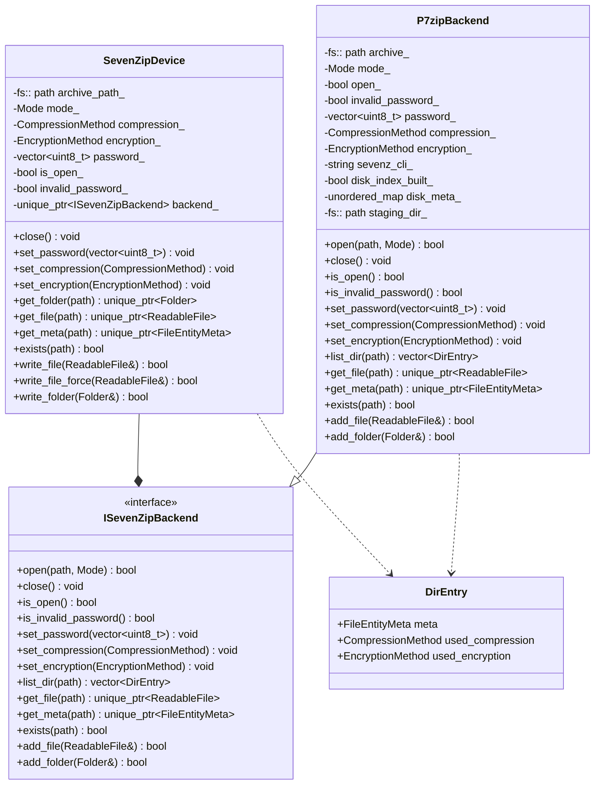
```mermaid
classDiagram
    class SevenZipDevice {
        -fs:: path archive_path_
        -Mode mode_
        -CompressionMethod compression_
        -EncryptionMethod encryption_
        -vector~uint8_t~ password_
        -bool is_open_
        -bool invalid_password_
        -unique_ptr~ISevenZipBackend~ backend_
        +close() void
        +set_password(vector~uint8_t~) void
        +set_compression(CompressionMethod) void
        +set_encryption(EncryptionMethod) void
        +get_folder(path) unique_ptr~Folder~
        +get_file(path) unique_ptr~ReadableFile~
        +get_meta(path) unique_ptr~FileEntityMeta~
        +exists(path) bool
        +write_file(ReadableFile&) bool
        +write_file_force(ReadableFile&) bool
        +write_folder(Folder&) bool
    }
    class ISevenZipBackend {
        <<interface>>
        +open(path, Mode) bool
        +close() void
        +is_open() bool
        +is_invalid_password() bool
        +set_password(vector~uint8_t~) void
        +set_compression(CompressionMethod) void
        +set_encryption(EncryptionMethod) void
        +list_dir(path) vector~DirEntry~
        +get_file(path) unique_ptr~ReadableFile~
        +get_meta(path) unique_ptr~FileEntityMeta~
        +exists(path) bool
        +add_file(ReadableFile&) bool
        +add_folder(Folder&) bool
    }
    class P7zipBackend {
        -fs:: path archive_
        -Mode mode_
        -bool open_
        -bool invalid_password_
        -vector~uint8_t~ password_
        -CompressionMethod compression_
        -EncryptionMethod encryption_
        -string sevenz_cli_
        -bool disk_index_built_
        -unordered_map<fs:: path, FileEntityMeta> disk_meta_
        -fs:: path staging_dir_
        +open(path, Mode) bool
        +close() void
        +is_open() bool
        +is_invalid_password() bool
        +set_password(vector~uint8_t~) void
        +set_compression(CompressionMethod) void
        +set_encryption(EncryptionMethod) void
        +list_dir(path) vector~DirEntry~
        +get_file(path) unique_ptr~ReadableFile~
        +get_meta(path) unique_ptr~FileEntityMeta~
        +exists(path) bool
        +add_file(ReadableFile&) bool
        +add_folder(Folder&) bool
    }
    class DirEntry {
        +FileEntityMeta meta
        +CompressionMethod used_compression
        +EncryptionMethod used_encryption
    }
    SevenZipDevice --* ISevenZipBackend
    P7zipBackend --|> ISevenZipBackend
    P7zipBackend ..> DirEntry
    SevenZipDevice ..> DirEntry
```

对于7-Zip的支持，我们采用了调用外部命令行工具`7z`（或`7za`、`7zr`）的方式来实现读写功能，因此我们定义了一个`ISevenZipBackend`接口，封装了所有与7z交互的细节。一方面是7-Zip格式本身比较复杂，虽然也是开源打包格式，但参考资料较少，自己实现一个7z读写器工作量较大；另一方面是7-Zip的命令行工具功能强大，支持多种压缩和加密算法，且跨平台支持良好，直接调用命令行工具可以大大简化实现难度。`P7zipBackend`是`ISevenZipBackend`的一个具体实现，使用`7z`命令行工具来进行实际的读写操作。

下面解释`ISevenZipBackend`和`P7zipBackend`的实现：

- `open(path, Mode)`: 读模式解析归档、构建路径->元数据索引并检测密码；写模式创建临时目录并保存 CLI 位置；失败时保持关闭且`is_open=false`。
- `close()`: 读模式释放索引；写模式如`staging`存在则调用 7z CLI 打包并清理临时目录；重置状态。
- `is_open() / is_invalid_password()`: 反映当前句柄状态与密码校验结果（仅读模式）。
- `set_password(vector<uint8_t>)`: 缓存密码；读模式下重开归档并重新验证密码；写模式仅缓存用于最终打包。
- `set_compression(CompressionMethod)` / `set_encryption(EncryptionMethod)`: 仅影响写模式生成的 7z（读模式回填`DirEntry.used_*` 反映实际算法）。
- `list_dir(path)`: 返回路径下子项（通过索引过滤 parent 匹配）；用于`SevenZipDevice`的 `get_folder` 构造目录树。
- `get_file(path)`: 返回指定路径的`ReadableFile`；读模式解密/解压由后端处理；写模式不可用。
- `get_meta(path)`: 返回单个条目的`FileEntityMeta`；若不存在返回空。
- `exists(path)`: 基于索引/暂存镜像判断存在性。
- `add_file(ReadableFile&)`: 写模式将文件内容落到`staging`；同名覆盖或遵循调用方的`force`策略；读模式返回`false`。
- `add_folder(Folder&)`: 写模式创建目录结构到`staging`；读模式返回`false`。

## 3.4 北向系统实现

目前我们只完成了cli版本的北向系统，并预留了gui版本的接口设计。北向系统主要负责解析用户输入的参数，构造源设备和目标设备，并调用备份控制器进行备份或恢复操作。

#### 3.4.1 备份控制器实现

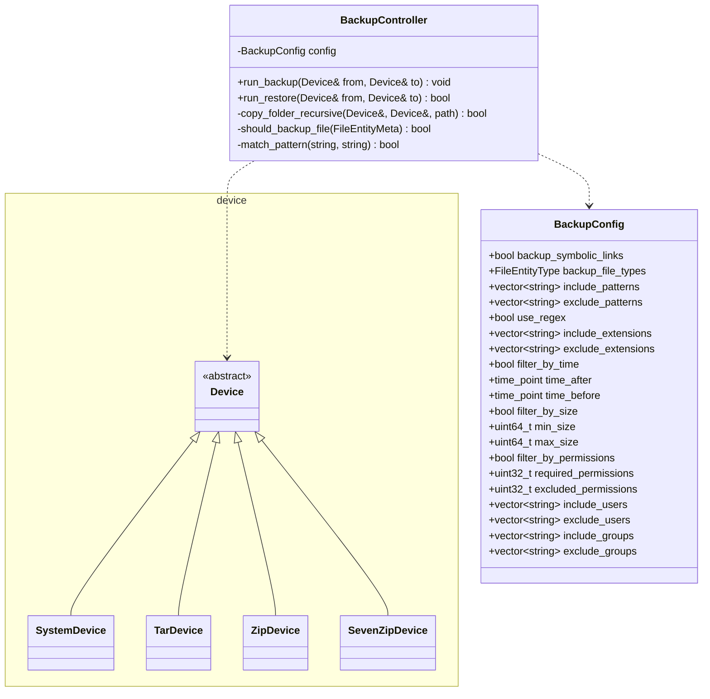
```mermaid
classDiagram
    class BackupConfig {
        +bool backup_symbolic_links
        +FileEntityType backup_file_types
        +vector~string~ include_patterns
        +vector~string~ exclude_patterns
        +bool use_regex
        +vector~string~ include_extensions
        +vector~string~ exclude_extensions
        +bool filter_by_time
        +time_point time_after
        +time_point time_before
        +bool filter_by_size
        +uint64_t min_size
        +uint64_t max_size
        +bool filter_by_permissions
        +uint32_t required_permissions
        +uint32_t excluded_permissions
        +vector~string~ include_users
        +vector~string~ exclude_users
        +vector~string~ include_groups
        +vector~string~ exclude_groups
    }
    class BackupController {
        -BackupConfig config
        +run_backup(Device& from, Device& to) void
        +run_restore(Device& from, Device& to) bool
        -copy_folder_recursive(Device&, Device&, path) bool
        -should_backup_file(FileEntityMeta) bool
        -match_pattern(string, string) bool
    }
    namespace device {
        class Device {
            <<abstract>>
        }
        class SystemDevice
        class TarDevice
        class ZipDevice
        class SevenZipDevice
    }
    BackupController ..> BackupConfig
    BackupController ..> Device
    Device <|-- SystemDevice
    Device <|-- TarDevice
    Device <|-- ZipDevice
    Device <|-- SevenZipDevice
```

- 配置结构：`BackupConfig` 聚合过滤与权限策略，涵盖路径/扩展名过滤、正则或通配符模式、时间窗口、大小范围、POSIX权限、用户/组筛选，以及备份文件类型与是否包含符号链接。
- 备份流程（`run_backup`）：
    - BFS 队列遍历源 `SystemDevice` 文件树；对于目录先 `write_folder` 到目标。
    - 每个子项先检查类型掩码 `backup_file_types`，再走 `should_backup_file` 过滤（路径模式、扩展、时间、大小、权限、用户/组）。
    - 目录入队继续遍历；普通/符号/设备文件取 `get_file` 后写入 `to.write_file`，末尾 `close` 文件句柄。
- 恢复流程（`run_restore`）：
    - 调用 `copy_folder_recursive` 深度优先：先写目录，再写文件，确保父目录存在；文件写入使用 `write_file_force` 以支持覆盖。
    - 同样复用 `should_backup_file` 做过滤（使恢复可按条件挑选）。
- 过滤逻辑（`should_backup_file`）：
    - 路径统一转 `/` 做匹配；先 include 再 exclude；支持通配符/正则。
    - 扩展名包含/排除仅作用于普通文件；时间/大小过滤独立开关；POSIX 权限按需/排除位检查。
    - 用户/组包含与排除列表均可叠加。
- 模式匹配（`match_pattern`）：
    - `use_regex` 时直接`regex_search`；否则通配符转 regex（`*`→`.*`，`?`→`.`，其余转义），无通配符时退化为子串匹配（包裹 `.*`）。

#### 3.4.2 命令行界面实现

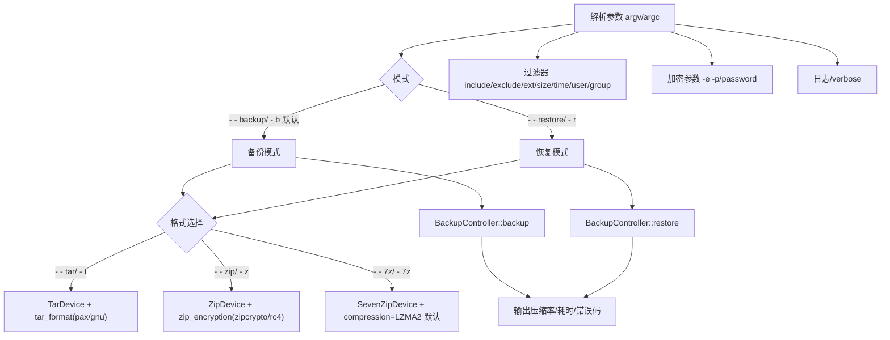
```mermaid
flowchart TD
    A["解析参数 argv/argc"] --> B{模式}
    B -->|- - backup/ - b 默认| C["备份模式"]
    B -->|- - restore/ - r| D["恢复模式"]
    C --> E{格式选择}
    D --> E
    E -->|- - tar/ - t| F["TarDevice + tar_format(pax/gnu)"]
    E -->|- - zip/ - z| G["ZipDevice + zip_encryption(zipcrypto/rc4)"]
    E -->|- - 7z/ - 7z| H["SevenZipDevice + compression=LZMA2 默认"]
    A --> I["过滤器 include/exclude/ext/size/time/user/group"]
    A --> J["加密参数 -e -p/password"]
    A --> K["日志/verbose"]
    C --> L["BackupController::backup"]
    D --> M["BackupController::restore"]
    L --> N["输出压缩率/耗时/错误码"]
    M --> N
```

- 入口：`main.cpp` 解析 `argc/argv`，默认备份模式，可切换 `-r/--restore`；必须提供 `source_path` 与 `target_path`。
- 格式开关：`-t/--tar`（可选 `--tar-format pax|gnu`，默认 pax）、`-z/--zip`（可选 `--zip-encryption zipcrypto|rc4|aes`），`-7z/--7z`（压缩算法默认 LZMA2，`-e/-p` 触发 AES 头加密）。
- 加密：`-e/--encrypt` 启用，`-p/--password` 传递密码；若启用加密而无密码会报错。Tar 不支持加密开关。
- 过滤器（备份模式）：支持多次 `--include/--exclude`，`--regex` 切换正则匹配；`--include-ext/--exclude-ext`；时间窗口`--after/--before`（YYYY-MM-DD）；尺寸 `--min-size/--max-size`；用户/组过滤`--include-user/--exclude-user/--include-group/--exclude-group`。
- 输出：`-v/--verbose` 打印更多日志，`-h/--help` 打印用法并退出。
- 主流程：参数校验 -> 构造源 `SystemDevice` 与目标设备 (Tar/Zip/7z) -> 调用 `BackupController` 执行备份或恢复 ->  关闭设备 -> 输出统计/返回码。
- 恢复：与备份相同的格式选择逻辑，目标为 `SystemDevice`；可选 CRC/大小校验（Zip 默认，Tar 可选，7z 由后端提供）。

## 3.5 工具类实现

这里我们将会介绍之前涉及到的一些工具类的实现细节，包括数据库接口、CRC32计算和流加密等。

#### 3.5.1 数据库接口实现

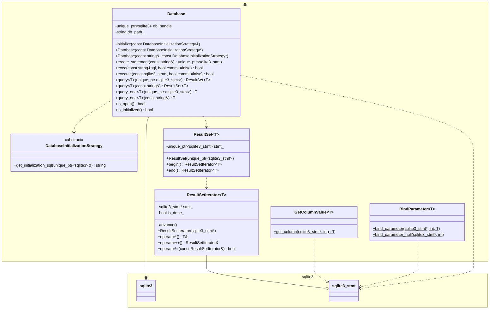
```mermaid
classDiagram
namespace db {
    class dbis["DatabaseInitializationStrategy"] {
        <<abstract>>
        +get_initialization_sql(unique_ptr~sqlite3~&) string
    }
    class GetColumnValue~T~ {
        +get_column(sqlite3_stmt*, int) T$
    }
    class BindParameter~T~ {
        +bind_parameter(sqlite3_stmt*, int, T)$
        +bind_parameter_null(sqlite3_stmt*, int)$
    }
    class ResultSetIterator~T~ {
        -sqlite3_stmt* stmt_
        -bool is_done_
        -advance()
        +ResultSetIterator(sqlite3_stmt*)
        +operator*() T&
        +operator++() ResultSetIterator&
        +operator!=(const ResultSetIterator&) bool
    }
    class ResultSet~T~ {
        -unique_ptr~sqlite3_stmt~ stmt_
        +ResultSet(unique_ptr~sqlite3_stmt~)
        +begin() ResultSetIterator~T~
        +end() ResultSetIterator~T~
    }
    class Database {
        -unique_ptr~sqlite3~ db_handle_
        -string db_path_
        -initialize(const DatabaseInitializationStrategy&)
        +Database(const DatabaseInitializationStrategy*)
        +Database(const string&, const DatabaseInitializationStrategy*)
        +create_statement(const string&) unique_ptr~sqlite3_stmt~
        +exec(const string&sql, bool commit=false) bool
        +execute(const sqlite3_stmt*, bool commit=false) bool
        +query~T~(unique_ptr~sqlite3_stmt~) ResultSet~T~
        +query~T~(const string&) ResultSet~T~
        +query_one~T~(unique_ptr~sqlite3_stmt~) T
        +query_one~T~(const string&) T
        +is_open() bool
        +is_initialized() bool
    }
}
namespace sqlite3 {
    class s3["sqlite3"]
    class sqlite3_stmt
}
Database ..> dbis
ResultSet~T~ ..> ResultSetIterator~T~
ResultSetIterator~T~ --o sqlite3_stmt
GetColumnValue~T~ ..> sqlite3_stmt
BindParameter~T~ ..> sqlite3_stmt
Database --* s3
Database ..> sqlite3_stmt
Database ..> ResultSet~T~
```

这里我们自己实现了一个简单的SQLite3数据库接口封装类`Database`，用于简化SQLite3的使用。该类支持两种初始化方式，一种是内存数据库，另一种是文件数据库。初始化时需要传入一个`DatabaseInitializationStrategy`接口，用于提供初始化SQL语句。该类还提供了创建语句、执行SQL、查询结果等方法，支持模板化的查询结果类型、自动绑定查询结果到C++类型。

- `Database(const DatabaseInitializationStrategy*)`：创建内存数据库，并调用初始化策略执行初始化SQL。
- `Database(const string&, const DatabaseInitializationStrategy*)`：创建文件数据库，并调用初始化策略执行初始化SQL。
- `create_statement(const string&)`：创建一个预编译的SQL语句。
- `exec(const string& sql, bool commit=false)`：执行一条SQL语句，可选提交事务。
- `execute(const sqlite3_stmt*, bool commit=false)`：执行预编译的SQL语句，可选提交事务。
- `query<T>(unique_ptr<sqlite3_stmt>)`：执行预编译的SQL语句并返回结果集。
- `query<T>(const string&)`：执行SQL语句并返回结果集。
- `query_one<T>(unique_ptr<sqlite3_stmt>)`：执行预编译的SQL语句并返回单个结果。
- `query_one<T>(const string&)`：执行SQL语句并返回单个结果。
- `is_open()`：检查数据库是否打开。
- `is_initialized()`：检查数据库是否已初始化。

#### 3.5.2 CRC32 计算实现

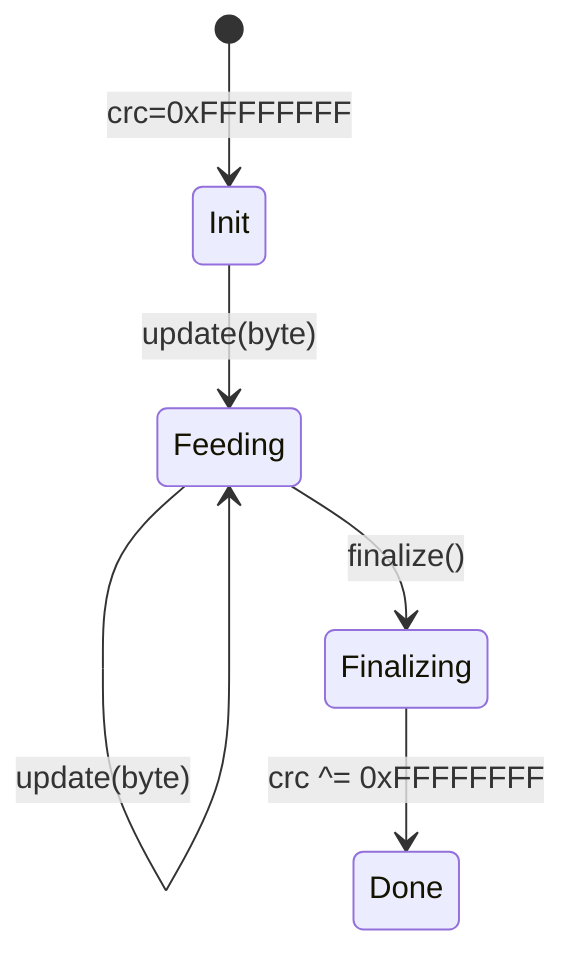
```mermaid
stateDiagram-v2
    [*] --> Init: crc=0xFFFFFFFF
    Init --> Feeding: update(byte)
    Feeding --> Feeding: update(byte)
    Feeding --> Finalizing: finalize()
    Finalizing --> Done: crc ^= 0xFFFFFFFF
```

- `Init`: 创建 `Crc32`，初始多项式寄存器设为 `0xFFFFFFFF`。
- `Feeding`: 多次调用 `update`（单字节或批量），循环查表累积 CRC。
- `Finalizing`: 调用 `finalize` 做反码得到最终 CRC。
- 输出：`uint32_t`，用于 Tar 索引、Zip 本地头/数据描述符校验。

#### 3.5.3 流加密实现（ZipCrypto / RC4）

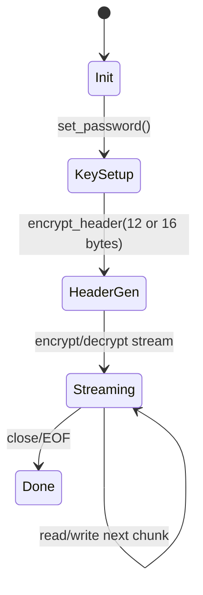
```mermaid
stateDiagram-v2
    [*] --> Init
    Init --> KeySetup: set_password()
    KeySetup --> HeaderGen: encrypt_header(12 or 16 bytes)
    HeaderGen --> Streaming: encrypt/decrypt stream
    Streaming --> Streaming: read/write next chunk
    Streaming --> Done: close/EOF
```

- ZipCrypto 加密流程：
    1. `KeySetup`: 以密码初始化三个32-bit key（0x12345678, 0x23456789, 0x34567890），每个字节更新 key 并经 CRC32 迭代。
    1. `HeaderGen`: 生成12字节随机头，前11字节随机，第12字节存放 DOS time 或 CRC 高字节；逐字节用当前 keystream XOR 后写出。
    1. `Streaming`: 对正文每字节，先用 key 生成 keystream 字节，再 XOR 数据，同时更新三个 key（key0 CRC、key1 线性、key2 CRC）。
    1. 解密同流程，先解出头部并校验第12字节；失败则判定密码错误。
- RC4 加密流程：
    1. `KeySetup`: 以密码或派生 key 执行 KSA 初始化 256-byte S 盒；`i=j=0`。
    1. `HeaderGen`: 生成16字节随机头，最后1字节存放 DOS time/CRC 高字节；通过 PRGA 产生 keystream XOR 头部写出。
    1. `Streaming`: PRGA 持续更新 `i,j` 与 S 盒，输出 keystream，与数据块逐字节 XOR；S 盒保持可复用。
    1. 解密同流程，先解头并校验末字节；校验失败则标记密码无效。
- 状态对齐：`KeySetup` 仅在设置密码后可进入；`HeaderGen` 在写模式生成头，在读模式解密并校验；`Streaming` 支持分块读写；`Done` 由 EOF 或 close 触发。

## 4. 动态建模

### 4.1 备份顺序图（Tar / Zip / 7z）

#### 4.1.1 备份到 Tar

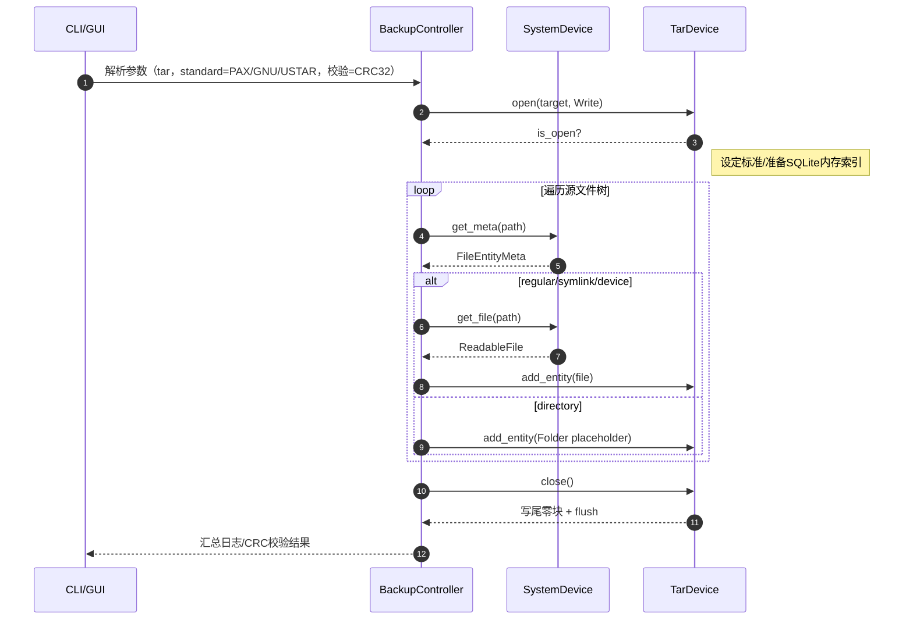
```mermaid
sequenceDiagram
    autonumber
    participant CLI as CLI/GUI
    participant Ctrl as BackupController
    participant Src as SystemDevice
    participant Tar as TarDevice
    CLI ->> Ctrl: 解析参数（tar，standard=PAX/GNU/USTAR，校验=CRC32）
    Ctrl ->> Tar: open(target, Write)
    Tar -->> Ctrl: is_open?
    Note right of Tar: 设定标准/准备SQLite内存索引
    loop 遍历源文件树
        Ctrl ->> Src: get_meta(path)
        Src -->> Ctrl: FileEntityMeta
        alt regular/symlink/device
            Ctrl ->> Src: get_file(path)
            Src -->> Ctrl: ReadableFile
            Ctrl ->> Tar: add_entity(file)
        else directory
            Ctrl ->> Tar: add_entity(Folder placeholder)
        end
    end
    Ctrl ->> Tar: close()
    Tar -->> Ctrl: 写尾零块 + flush
    Ctrl -->> CLI: 汇总日志/CRC校验结果
```

#### 4.1.2 备份到 Zip

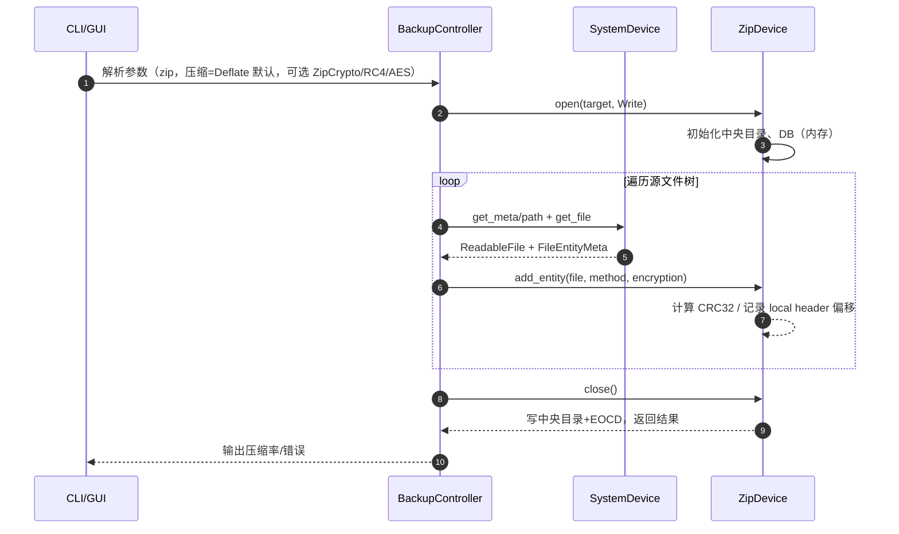
```mermaid
sequenceDiagram
    autonumber
    participant CLI as CLI/GUI
    participant Ctrl as BackupController
    participant Src as SystemDevice
    participant Zip as ZipDevice
    CLI ->> Ctrl: 解析参数（zip，压缩=Deflate 默认，可选 ZipCrypto/RC4/AES）
    Ctrl ->> Zip: open(target, Write)
    Zip ->> Zip: 初始化中央目录、DB（内存）
    loop 遍历源文件树
        Ctrl ->> Src: get_meta/path + get_file
        Src -->> Ctrl: ReadableFile + FileEntityMeta
        Ctrl ->> Zip: add_entity(file, method, encryption)
        Zip -->> Zip: 计算 CRC32 / 记录 local header 偏移
    end
    Ctrl ->> Zip: close()
    Zip -->> Ctrl: 写中央目录+EOCD，返回结果
    Ctrl -->> CLI: 输出压缩率/错误
```

#### 4.1.3 备份到 7z

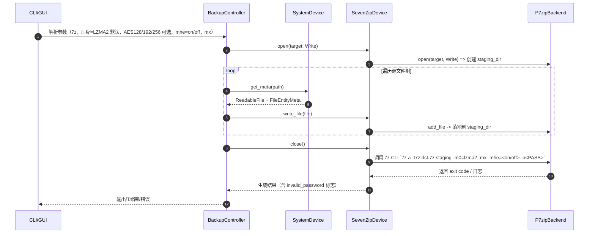
```mermaid
sequenceDiagram
    autonumber
    participant CLI as CLI/GUI
    participant Ctrl as BackupController
    participant Src as SystemDevice
    participant SZ as SevenZipDevice
    participant P7 as P7zipBackend
    CLI ->> Ctrl: 解析参数（7z，压缩=LZMA2 默认，AES128/192/256 可选，mhe=on/off，mx）
    Ctrl ->> SZ: open(target, Write)
    SZ ->> P7: open(target, Write) => 创建 staging_dir
    loop 遍历源文件树
        Ctrl ->> Src: get_meta(path)
        Src -->> Ctrl: ReadableFile + FileEntityMeta
        Ctrl ->> SZ: write_file(file)
        SZ ->> P7: add_file -> 落地到 staging_dir
    end
    Ctrl ->> SZ: close()
    SZ ->> P7: 调用 7z CLI `7z a -t7z dst.7z staging -m0=lzma2 -mx -mhe=<on/off> -p<PASS>`
    P7 -->> SZ: 返回 exit code / 日志
    SZ -->> Ctrl: 生成结果（含 invalid_password 标志）
    Ctrl -->> CLI: 输出压缩率/错误
```

#### 4.1.4 CLI 端到端备份

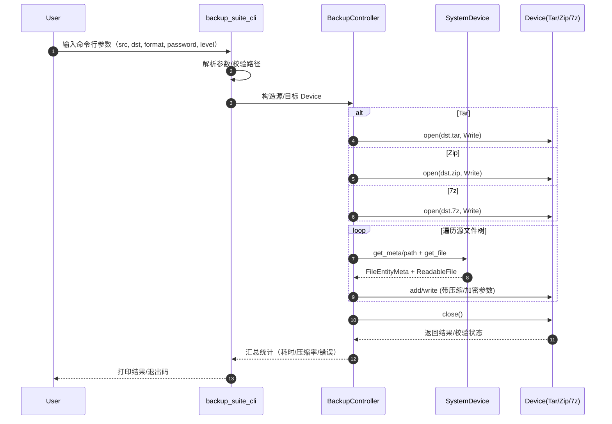
```mermaid
sequenceDiagram
    autonumber
    participant User
    participant CLI as backup_suite_cli
    participant Ctrl as BackupController
    participant Src as SystemDevice
    participant Dst as Device(Tar/Zip/7z)
    User ->> CLI: 输入命令行参数（src, dst, format, password, level）
    CLI ->> CLI: 解析参数/校验路径
    CLI ->> Ctrl: 构造源/目标 Device
    alt Tar
        Ctrl ->> Dst: open(dst.tar, Write)
    else Zip
        Ctrl ->> Dst: open(dst.zip, Write)
    else 7z
        Ctrl ->> Dst: open(dst.7z, Write)
    end
    loop 遍历源文件树
        Ctrl ->> Src: get_meta/path + get_file
        Src -->> Ctrl: FileEntityMeta + ReadableFile
        Ctrl ->> Dst: add/write (带压缩/加密参数)
    end
    Ctrl ->> Dst: close()
    Dst -->> Ctrl: 返回结果/校验状态
    Ctrl -->> CLI: 汇总统计（耗时/压缩率/错误）
    CLI -->> User: 打印结果/退出码
```

#### 4.1.5 CLI 端到端恢复

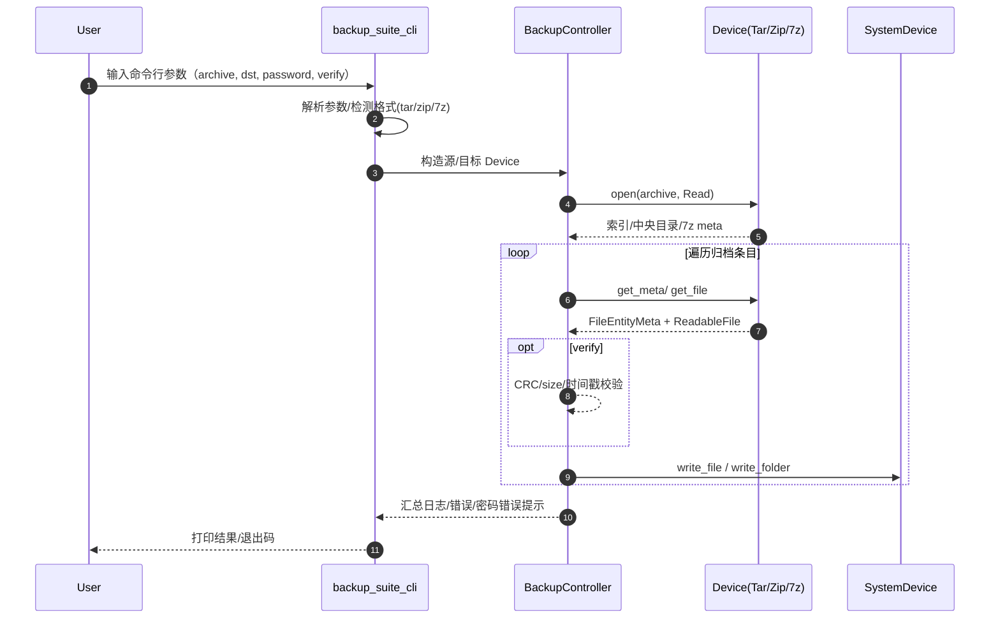
```mermaid
sequenceDiagram
    autonumber
    participant User
    participant CLI as backup_suite_cli
    participant Ctrl as BackupController
    participant Src as Device(Tar/Zip/7z)
    participant Dst as SystemDevice
    User ->> CLI: 输入命令行参数（archive, dst, password, verify）
    CLI ->> CLI: 解析参数/检测格式(tar/zip/7z)
    CLI ->> Ctrl: 构造源/目标 Device
    Ctrl ->> Src: open(archive, Read)
    Src -->> Ctrl: 索引/中央目录/7z meta
    loop 遍历归档条目
        Ctrl ->> Src: get_meta/ get_file
        Src -->> Ctrl: FileEntityMeta + ReadableFile
        opt verify
            Ctrl -->> Ctrl: CRC/size/时间戳校验
        end
        Ctrl ->> Dst: write_file / write_folder
    end
    Ctrl -->> CLI: 汇总日志/错误/密码错误提示
    CLI -->> User: 打印结果/退出码
```

### 4.2 恢复顺序图（Tar / Zip / 7z）

#### 4.2.1 从 Tar 恢复

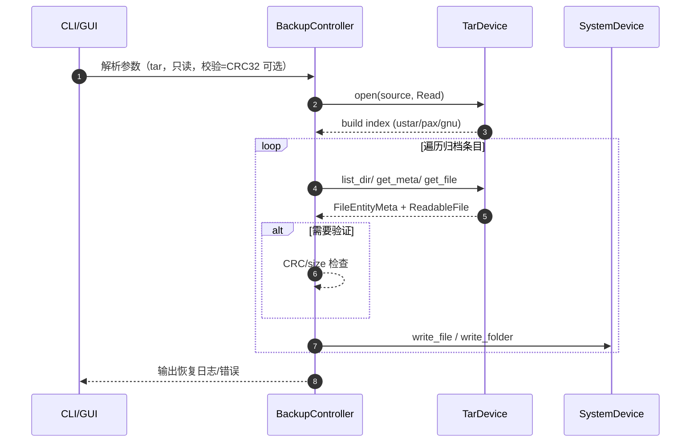
```mermaid
sequenceDiagram
    autonumber
    participant CLI as CLI/GUI
    participant Ctrl as BackupController
    participant Tar as TarDevice
    participant Dst as SystemDevice
    CLI ->> Ctrl: 解析参数（tar，只读，校验=CRC32 可选）
    Ctrl ->> Tar: open(source, Read)
    Tar -->> Ctrl: build index (ustar/pax/gnu)
    loop 遍历归档条目
        Ctrl ->> Tar: list_dir/ get_meta/ get_file
        Tar -->> Ctrl: FileEntityMeta + ReadableFile
        alt 需要验证
            Ctrl -->> Ctrl: CRC/size 检查
        end
        Ctrl ->> Dst: write_file / write_folder
    end
    Ctrl -->> CLI: 输出恢复日志/错误
```

#### 4.2.2 从 Zip 恢复

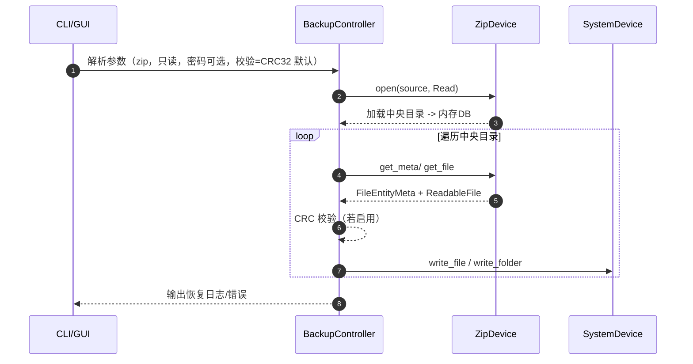
```mermaid
sequenceDiagram
    autonumber
    participant CLI as CLI/GUI
    participant Ctrl as BackupController
    participant Zip as ZipDevice
    participant Dst as SystemDevice
    CLI ->> Ctrl: 解析参数（zip，只读，密码可选，校验=CRC32 默认）
    Ctrl ->> Zip: open(source, Read)
    Zip -->> Ctrl: 加载中央目录 -> 内存DB
    loop 遍历中央目录
        Ctrl ->> Zip: get_meta/ get_file
        Zip -->> Ctrl: FileEntityMeta + ReadableFile
        Ctrl -->> Ctrl: CRC 校验（若启用）
        Ctrl ->> Dst: write_file / write_folder
    end
    Ctrl -->> CLI: 输出恢复日志/错误
```

#### 4.2.3 从 7z 恢复

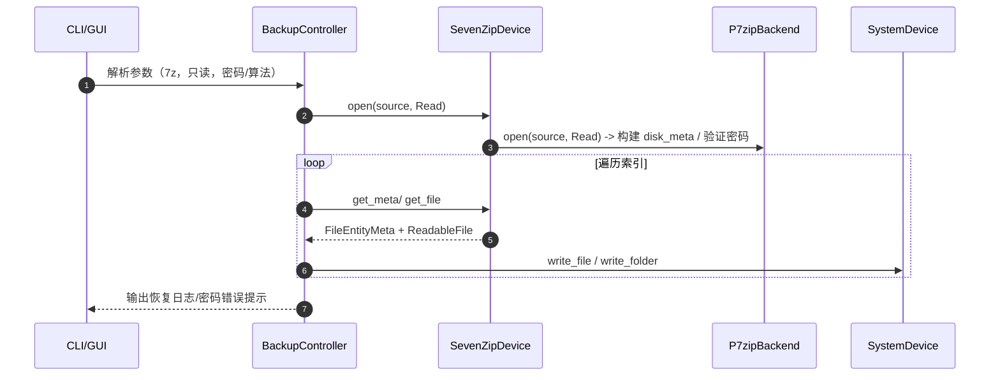
```mermaid
sequenceDiagram
    autonumber
    participant CLI as CLI/GUI
    participant Ctrl as BackupController
    participant SZ as SevenZipDevice
    participant P7 as P7zipBackend
    participant Dst as SystemDevice
    CLI ->> Ctrl: 解析参数（7z，只读，密码/算法）
    Ctrl ->> SZ: open(source, Read)
    SZ ->> P7: open(source, Read) -> 构建 disk_meta / 验证密码
    loop 遍历索引
        Ctrl ->> SZ: get_meta/ get_file
        SZ -->> Ctrl: FileEntityMeta + ReadableFile
        Ctrl ->> Dst: write_file / write_folder
    end
    Ctrl -->> CLI: 输出恢复日志/密码错误提示
```

### 4.3 状态转换图

#### 4.3.1 TarDevice 状态

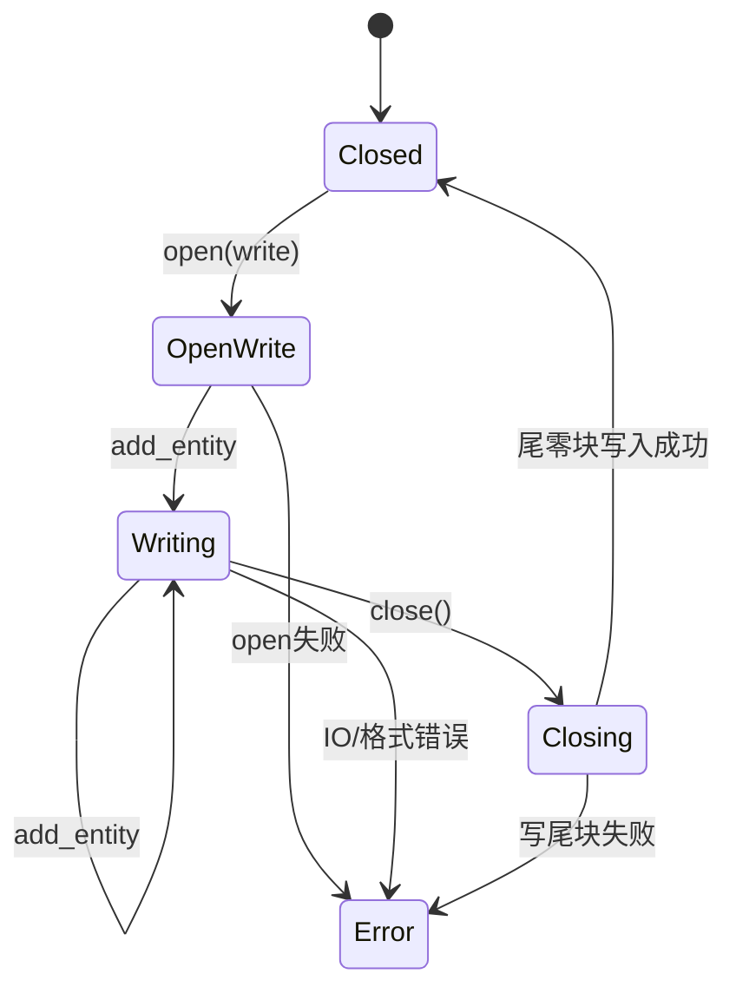
```mermaid
stateDiagram-v2
    [*] --> Closed
    Closed --> OpenWrite: open(write)
    OpenWrite --> Writing: add_entity
    Writing --> Writing: add_entity
    Writing --> Closing: close()
    Closing --> Closed: 尾零块写入成功
    OpenWrite --> Error: open失败
    Writing --> Error: IO/格式错误
    Closing --> Error: 写尾块失败
```

#### 4.3.2 ZipDevice 状态

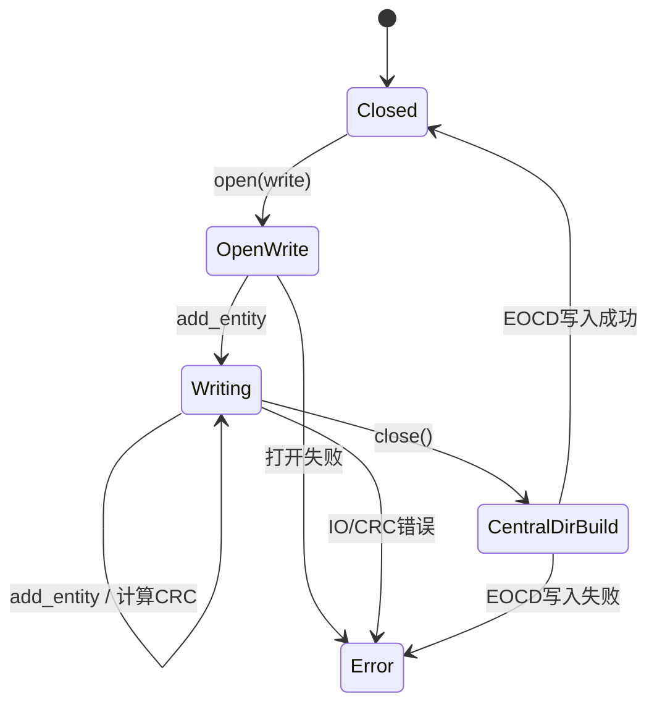
```mermaid
stateDiagram-v2
    [*] --> Closed
    Closed --> OpenWrite: open(write)
    OpenWrite --> Writing: add_entity
    Writing --> Writing: add_entity / 计算CRC
    Writing --> CentralDirBuild: close()
    CentralDirBuild --> Closed: EOCD写入成功
    OpenWrite --> Error: 打开失败
    Writing --> Error: IO/CRC错误
    CentralDirBuild --> Error: EOCD写入失败
```

#### 4.3.3 SevenZipDevice 状态

```mermaid
stateDiagram-v2
    [*] --> Closed
    Closed --> OpenWrite: open(write)
    OpenWrite --> Staging: add_file/add_folder
    Staging --> Staging: 持续写入 staging_dir
    Staging --> Packing: close() 调用7z CLI
    Packing --> Closed: 7z CLI 成功，输出归档
    OpenWrite --> Error: 打开/创建 staging 失败
    Staging --> Error: IO/路径错误
    Packing --> Error: CLI 返回非0/密码错误
```

## 5. 数据库设计

### 5.1 引言

- 目的：为归档索引（tar/zip，未来可扩展 7z）提供统一的 SQLite 元数据结构，便于列表、过滤、校验与跨工具互操作。
- 范围：仅记录归档内条目元数据，不存储实际文件内容；核心由 `entity_type`（枚举）、`tar_entity`、`zip_entity` 三类表组成，满足最小查询需求（路径、类型、大小、时间、权限、偏移等）。
- 原则：
    - 兼容性：字段与 tar/zip 标准字段对齐，可映射到 C++ 结构（`FileEntityMeta`、CDFH 等）。
    - 规范化：表结构满足 3NF；枚举抽离；时间/权限/偏移保持原子字段。
    - 可扩展：保留扩展字段（extra/attributes），未来可添加哈希、增量快照标记或 7z-specific 字段。

### 5.2 数据库逻辑设计

- 逻辑模型使用最小实体集：`entity_type`（枚举）、`tar_entity`、`zip_entity`。
- 关系描述：
    - `entity_type`(1) ——< `tar_entity`.type
    - `zip_entity` 无外键依赖（直接存中央目录信息），可按需要增加 `entity_type` 外键。

```mermaid
erDiagram
  entity_type ||--o{ tar_entity : maps
  tar_entity {
    int id PK
    text path
    int type FK
    int size
    int offset
    datetime creation_time
    datetime modification_time
    datetime access_time
    int posix_mode
    int uid
    int gid
    text user_name
    text group_name
    int windows_attributes
    text symlink_target
    int device_major
    int device_minor
  }
  entity_type {
    int id PK
    text name
  }
  zip_entity {
    int id PK
    text path
    int version_made_by
    int version_needed
    int flag
    int method
    int dos_time
    int dos_date
    int crc32
    int compressed_size
    int uncompressed_size
    int local_header_offset
    blob extra
    text comment
  }
```

### 5.3 数据库物理设计

- 物理模型：采用***SQLite***；字段类型包括`INTEGER`、`TEXT`、`BLOB`、`DATETIME`。
- 存储与约束：
    - `entity_type`：主键、自增，`name` 唯一；初始化插入 tar 类型枚举。
    - `tar_entity`：`type` 外键引用 `entity_type.id`；`path` 上可加 UNIQUE 索引；时间戳以 DATETIME 存储。
    - `zip_entity`：以 ZIP 中央目录字段直存；`path` 建议唯一索引；`method`/`flag` 保持原值便于兼容。
- 规范化：均满足***3NF***；可根据访问模式加覆盖索引（如 `path`、`type`）。
- 未来扩展：可新增 `hash`（`BLOB`）用于完整性校验；`archive_info` 表记录归档级元数据（创建时间、工具版本、加密标志）。

### 5.4 基表设计

_Tar `entity_type`_

| 字段   | 类型          | 备注      |
|------|-------------|---------|
| id   | INTEGER PK  | 具体内容见下表 |
| name | TEXT UNIQUE | 枚举名称    |

| id   | name             |
|------|------------------|
| 0    | unknown          |
| 1<<0 | regular file     |
| 1<<1 | directory        |
| 1<<2 | symbolic link    |
| 1<<3 | fifo             |
| 1<<4 | socket           |
| 1<<5 | block device     |
| 1<<6 | character device |

_Tar `entity`_

| 字段                   | 类型                                | C++类型绑定   | 备注                  |
|----------------------|-----------------------------------|-----------|---------------------|
| id                   | INTEGER PRIMARY KEY AUTOINCREMENT | int       | 主键                  |
| path                 | TEXT NOT NULL                     | string    | 归档内相对路径             |
| type                 | INTEGER NOT NULL                  | int       | 外键，映射entity_type.id |
| size                 | INTEGER NOT NULL                  | int       | 文件大小（字节）            |
| offset               | INTEGER NOT NULL                  | int       | 数据块起始偏移             |
| creation_time        | DATETIME NOT NULL                 | long long | 创建时间                |
| modification_time    | DATETIME NOT NULL                 | long long | 修改时间                |
| access_time          | DATETIME NOT NULL                 | long long | 访问时间                |
| posix_mode           | INTEGER NOT NULL DEFAULT 0        | int       | POSIX 权限            |
| uid                  | INTEGER NOT NULL DEFAULT 0        | int       | UID                 |
| gid                  | INTEGER NOT NULL DEFAULT 0        | int       | GID                 |
| user_name            | TEXT NOT NULL DEFAULT ''          | string    | 用户                  |
| group_name           | TEXT NOT NULL DEFAULT ''          | string    | 组名                  |
| windows_attributes   | INTEGER NOT NULL DEFAULT 0        | int       | Windows 属性掩码        |
| symbolic_link_target | TEXT                              | string    | 符号链接目标              |
| device_major         | INTEGER DEFAULT 0                 | int       | 设备号                 |
| device_minor         | INTEGER DEFAULT 0                 | int       | 设备号                 |

_Zip `zip_entity`_

| 字段                  | 类型                                     | C++类型绑定         | 备注         |
|---------------------|----------------------------------------|-----------------|------------|
| id                  | INTEGER PRIMARY KEY AUTOINCREMENT      | int             | 主键         |
| version_made_by     | INTEGER NOT NULL                       | uint8_t         | 生成端平台/版本   |
| version_needed      | INTEGER DEFAULT 10                     | uint16_t        | 解压所需版本     |
| general_purpose     | INTEGER DEFAULT 0                      | uint16_t        | 标志位（含加密标志） |
| compression_method  | INTEGER DEFAULT 0                      | uint16_t        | 压缩方法       |
| last_modified       | DATETIME DEFAULT '1970-01-01 00:00:00' | long long       | 修改时间       |
| crc32               | INTEGER DEFAULT 0                      | uint32_t        | 校验值        |
| compressed_size     | INTEGER DEFAULT 0                      | uint32_t        | 压缩后大小      |
| uncompressed_size   | INTEGER DEFAULT 0                      | uint32_t        | 原始大小       |
| disk_number         | INTEGER DEFAULT 0                      | uint16_t        | 磁盘号        |
| internal_attributes | INTEGER DEFAULT 0                      | uint16_t        | 内部属性       |
| external_attributes | INTEGER DEFAULT 0                      | uint32_t        | 外部属性       |
| local_header_offset | INTEGER DEFAULT 0                      | uint32_t        | 本地文件头偏移    |
| filename            | TEXT NOT NULL DEFAULT ''               | string          | 文件名        |
| extra_field         | BLOB                                   | vector<uint8_t> | 额外字段       |
| file_comment        | TEXT DEFAULT ''                        | string          | 文件注释       |

### 5.5 视图设计

我们未使用视图。

### 5.6 索引设计

我们未使用索引。
