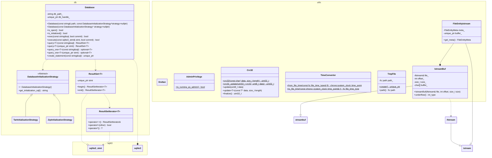
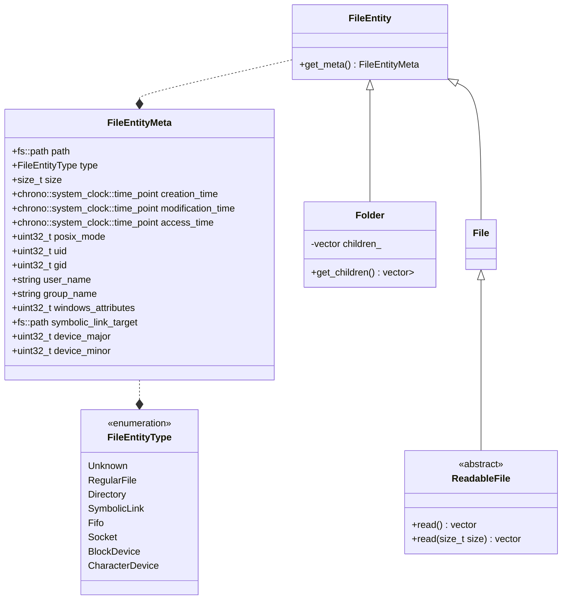
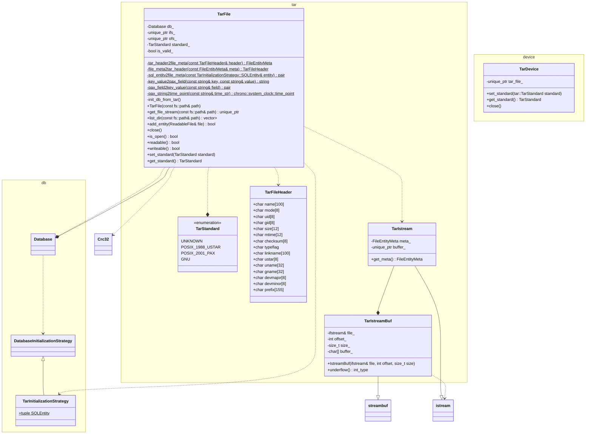

**系统设计文档（BackupSuite）**

**1. 开发环境和工具**

**1.1 开发环境**

- 硬件平台：x86_64 PC，$\ge 16GB$ RAM。
- 操作系统：Windows 11 64-bit。
- 编译环境：MSVC 19.44（VS 2022），CMake 3.28+，vcpkg manifest 模式，Ninja/VS 生成器，PowerShell 7。
- IDE：CLion 2025.3.1，Visual Studio 2022，Qt Creator。
- 版本控制：Git。

**1.2 依赖库**

- Qt 6（本机安装的 MSVC x64 版本，用于 GUI）。
- libarchive（tar/zip 读写），SQLite3（元数据存储），OpenSSL（可选，7z AES）。
- 7-Zip：third_party/7-Zip 中预构建的 7z.dll、7-zip.dll、7z.exe；若缺失可用 third_party/p7zip 源码回退。
- GoogleTest（单元测试）。

**2. 总体设计**

**2.1 系统结构设计**

**2.1.1 顶层系统结构**

- 主要组件：`backup_suite_core`(DLL)、`backup_suite_cli`、`backup_suite_gui`、`core_tests`、`third_party`。
- 交互：CLI/GUI 通过 core 统一调用设备与备份控制器；core 运行期加载 7z 相关二进制；tests 复用 core。

**2.1.1.1 构件图**
（文字描述）Core 向上提供 API，CLI/GUI 均链接 core；core 依赖 libarchive/SQLite/7z；tests 链接 core 与 gtest。

**2.1.1.2 构件图描述**

- `utils`: 工具类集合，包括字节序转换、CRC32计算、临时文件管理和读写zip、tar、7z等文件的类。
- `encryption`: 包括了所有实现了的加密算法，这里包括*ZipCrypto*和*RC4*两种（用于zip）。
- `filesystem`: 抽象备份设备的接口和具体实现类，包括对本地文件系统、tar、zip、7z等格式的支持。
- `backup_controller`: 负责备份和恢复的核心逻辑，协调源设备和目标设备之间的数据传输。
- `cli`：命令行界面，解析用户输入的参数，调用 core 进行备份或恢复操作。
- `gui`：图形用户界面，基于 Qt 实现，提供用户友好的交互界面。
- `tests`：单元测试模块，使用 GoogleTest 框架，验证核心功能的正确性。

**2.1.2 核心模块结构（core）**

这部分提供了备份软件的核心功能模块，包括了一个抽象的设备接口（Device）和多个具体的设备实现类（SystemDevice、TarDevice、ZipDevice、SevenZipDevice），以及负责备份和恢复操作的控制器（BackupController）。此外，还包含了一些辅助类，如 FileEntity 和 Folder，用于表示文件和目录的元数据，以及 Database 类，用于管理 SQLite 数据库索引。

**2.1.3 测试模块结构（tests）**

这部分包含了针对核心模块的单元测试，使用 GoogleTest 框架来验证各个类和方法的正确性。测试模块复用 core 模块的功能，确保其实现正确。

**2.1.4 命令行界面模块结构（cli）**

命令行界面模块负责解析用户通过命令行输入的参数，并调用核心模块的功能来执行备份或恢复操作。它提供了一个简单的接口，允许用户指定源和目标设备，以及其他配置选项。

**3. 静态建模**

**3.1 系统对象模型**

在本项目中，由于我们引入了HAL层（代码中没有直接体现，实际上对应`core/filesystem`中的代码），我们可以将整个系统根据其在HAL层的上方还是下方分成三个部分——HAL层、底层实现（南向）和上层应用（北向）。之后我们会根据这个顺序来描述系统对象模型。

**3.2 HAL层对象**

在HAL层（`core/filesystem`）中，我们为了抚平不同设备之间文件属性、文件读取方式的差异，同时为了兼容Linux和Windows文件系统，设计了一个中间表示层，主要包括：

- 一个统一的文件元数据表示`FileEntityMeta`，其中包括了Linux文件和Windows文件常见属性的并集；
- 一个统一的文件表示`FileEntity`以及其派生出的文件夹表示`Folder`、可读文件表示`ReadableFile`；
- 一个统一的设备接口`Device`，定义了基本的查找文件、读写文件接口。

**3.2.1 文件元数据表示**

在我们的文件元数据统一表示中，我们支持了Linux中可能出现的8种文件，虽然实际上我们几乎只会和普通文件、目录和符号链接打交道。具体的，我们的文件元数据统一表示取了Linux和Windows文件属性的并集，包括了所有文件系统中的文件所共有的文件路径、文件类型、文件大小和创建时间、修改时间、访问时间（Linux中没有创建时间）等基本属性；同时也包括了Linux中特有的POSIX权限、用户ID、组ID、用户名、组名等属性，以及Windows中特有的文件属性（如只读、隐藏等）。此外，我们还考虑到了符号链接和设备文件的特殊属性，分别用`symbolic_link_target`和`device_major`/`device_minor`来表示。

此外，我们在抽象层表示上还定义了`Folder`描述文件夹，`ReadableFile`描述可读文件，这两个类都继承自`FileEntity`。其中`Folder`拥有`get_children`方法来获取目录下所有文件；`ReadableFile`提供了`read`方法实现一次性读。

**3.2.2 设备接口**

在设备的统一表示中，我们定义了一个抽象的`Device`接口，包含了文件存在性检查、获取文件元数据、获取可读文件、获取文件夹以及写入文件和文件夹等基本操作。这样，不同类型的设备（如本地文件系统、tar归档、zip归档、7z归档等）都可以通过实现这个接口来提供统一的访问方式。

**3.3 南向设备实现**

这部分主要包括`SystemDevice`、`TarDevice`、`ZipDevice`和`SevenZipDevice`四个具体的设备实现类，它们都继承自`Device`接口，并实现了其中定义的各种方法。每个设备类都根据其特定的存储格式和访问方式来实现这些方法，从而提供对不同类型存储介质的统一访问。

由于篇幅有限，这里仅描述与这些设备实现**直接相关**的类与其中具体的实现细节。

**3.3.1 系统设备实现**

- `unique_ptr<Folder> get_folder(const fs::path&path, bool recursion=false)`: 通过 Windows API 遍历目录并构造`Folder`对象。
- `unique_ptr<ReadableFile> get_file(const fs::path&path)`: 通过`ifstream`打开文件流并封装为`PhysicalDeviceReadableFile`。
- `unique_ptr<ifstream> get_file_stream(const fs::path& path)`: 返回文件流`ifstream`对象。
- `unique_ptr<FileEntityMeta> get_meta(const fs::path& path)`: 通过 Windows API 获取文件属性并转换为`FileEntityMeta`，`get_meta`支持获取普通文件、目录和符号链接的元数据，并支持获取符号链接指向的路径、获取文件属性。
- `bool exists(const fs::path& path)`: 通过 Windows API 检查文件或目录是否存在。
- `bool _write_file(ReadableFile& file, bool force)`: 将`ReadableFile`内容写入本地文件系统，支持覆盖写入，会自动根据文件元数据的统一表示设置文件属性。
- `bool write_folder(Folder& folder)`: 创建目录本身（并不会递归创建子文件）。
- `bool set_file_attributes(const FileEntityMeta& meta)`: 利用 Windows API 根据`FileEntityMeta`设置文件属性，包括创建、修改、访问时间及只读、隐藏属性等。

**3.3.2 Tar 设备实现**

**4. 动态建模**

**4.1 系统场景**

**4.1.1 场景：CLI 7z 备份**

- 场景描述：用户执行 `backup_suite_cli -7z <src> <dst.7z>`，程序创建 SystemDevice/SevenZipDevice，调用 BackupController
  执行备份。
- 顺序图（文字步骤）：
    1. CLI 解析参数 -> 创建源/目标 Device。
    2. BackupController 遍历源 Folder -> 过滤 -> 写入目标。
    3. SevenZipDevice 结束写入，CLI 退出。

**4.1.2 场景：GUI 启动备份**

- 场景描述：用户在 Qt 界面配置源/目标/格式（zip/tar/7z），点击开始，GUI 构造 Device 并调用 BackupController，进度通过信号/槽显示。
- 顺序图（文字步骤）：
    1. 用户输入参数 -> MainWindow 构造 Device。
    2. BackupController 执行备份 -> 进度/日志回调到 GUI。
    3. 完成后弹出结果提示。

**4.1.3 场景：Tar 校验**

- 场景描述：TarDevice 只读打开 tar，利用 SQLite 索引校验文件存在性与内容。
- 顺序图（文字步骤）：
    1. TarDevice 初始化 -> 解析头/建索引。
    2. 调用 `exists/get_file` 校验条目。
    3. 读取或报错返回。

**4.2 系统状态**

- 重要对象状态示例（TarDevice）：未打开 -> 读/写打开 -> 读/写中 -> 关闭/错误。

**4.2.1 TarDevice 状态切换**

- 状态描述：
    - Closed：未打开或已关闭。
    - OpenRead：只读打开并索引完成。
    - OpenWrite：写打开，等待写入；close 时写入尾零块。
    - Error：打开/读写失败。
- 状态转换图（文字描述）：
    - Closed -> OpenRead（以只读模式打开且索引成功）。
    - Closed -> OpenWrite（以写模式创建）。
    - OpenWrite -> Closed（close 或析构，写尾块）。
    - 任意状态 -> Error（IO/格式错误）。

**5. 数据库设计（如有）**

**5.1 引言**

- 作用：为 tar（及部分索引需求）提供快速路径查询与偏移定位，便于随机访问与 `exists`/`get_file` 查询。

**5.2 数据库逻辑设计**

- 实体：`entity` 表，字段涵盖
  path/type/size/offset/time/权限/uid/gid/user/group/link/device_major/device_minor/windows_attributes。
- 约束：path 唯一；offset 指向归档内头部起始偏移。

**5.3 数据库物理设计**

- SQLite 文件（运行期生成，可位于临时目录或内嵌文件）；字段类型采用 TEXT/INTEGER。

**5.4 基表设计**
| 字段编号 | 英文字段名 | 中文字段名 | 字段类型 | 备注 |
| -------- | ----------------- | ------------ | -------- | --------------------------------- |
| 1 | path | 路径 | TEXT | 主键，归档内相对路径 |
| 2 | type | 类型 | INTEGER | FileEntityType 枚举 |
| 3 | size | 大小 | INTEGER | 字节 |
| 4 | offset | 偏移 | INTEGER | 头部起始偏移（字节） |
| 5 | ctime/mtime/atime | 时间戳 | INTEGER | 秒级 Unix 时间 |
| 6 | posix_mode | 权限 | INTEGER | POSIX mode |
| 7 | uid/gid | 用户/组 | INTEGER | |
| 8 | user/group | 用户名/组名 | TEXT | |
| 9 | link_target | 符号链接目标 | TEXT | 空则非符号链接 |
| 10 | device_major/minor| 设备号 | INTEGER | 设备文件用 |
| 11 | windows_attributes| Win 属性 | INTEGER | 可选 |

**5.5 视图设计**

- 当前未使用视图；如需可添加基于路径前缀的快捷视图。

**5.6 索引设计**
| 索引编号 | 基表名称 | 索引名称 | 字段集名称 | 备注 |
| -------- | -------- | ----------------- | ------------------- | --------------------- |
| 1 | entity | idx_entity_path | path | 唯一索引 |
| 2 | entity | idx_entity_type | type,path | 提升按类型枚举性能 |
