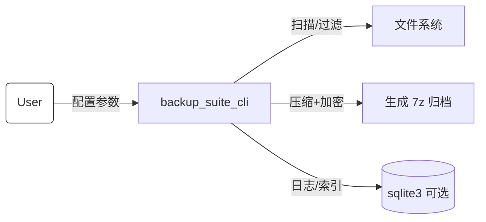
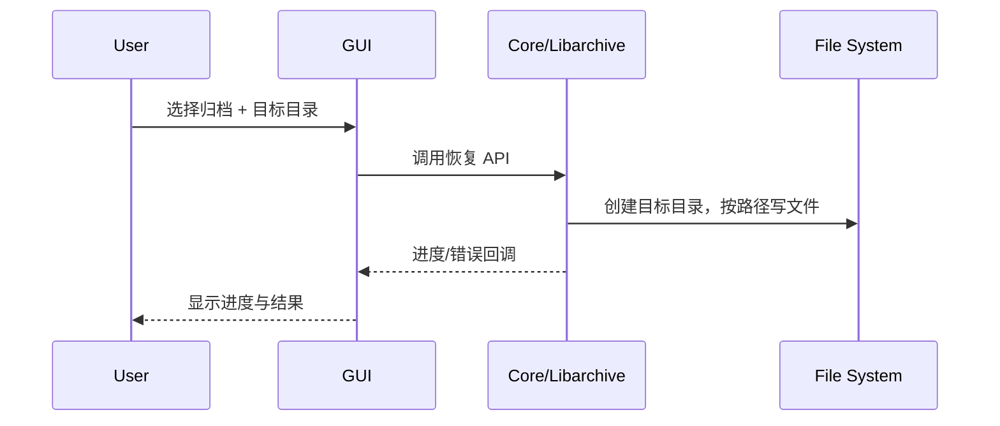
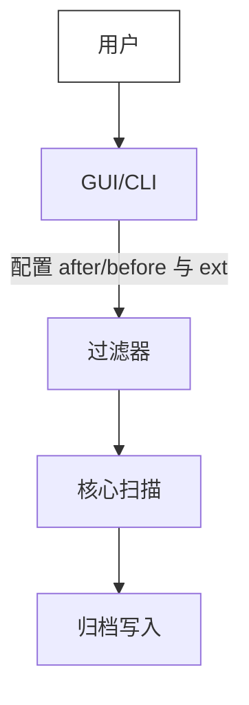
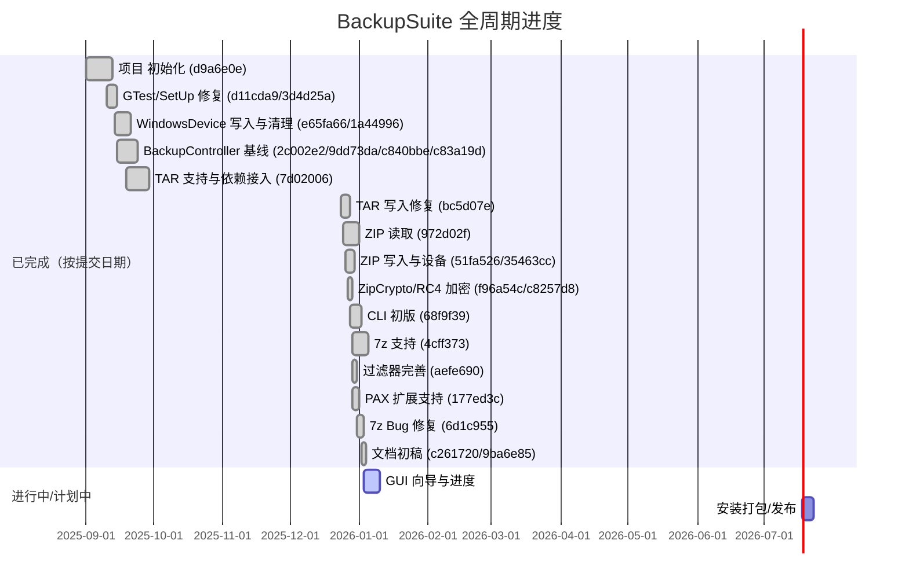

# 需求分析说明书

## 1. 任务概述

BackupSuite 是一款跨平台文件备份与恢复套件，提供命令行（CLI）与图形界面（GUI），支持多种归档格式、过滤规则、压缩与可选加密。本文档明确产品范围、用户、运行环境、功能与非功能需求以及项目规划。

### 1.1 引言

- 目的：为 BackupSuite 的设计、开发、测试与验收提供一致的需求基线。
- 读者：产品/项目负责人、开发、测试、运维与文档撰写人员。
- 参考：项目 README、系统设计文档、CMake/vcpkg 配置。

### 1.2 综合描述

#### 1.2.1 产品的状况

- 类型：新开发的自主产品，含 CLI 与 GUI 两个前端，共享核心库。
- 关联：核心功能为独立库，可被第三方工具复用；当前无外部强耦合系统，仅依赖操作系统和本地文件系统。
- 版本/演进：后续规划支持更多归档格式和增量/快照策略。

#### 1.2.2 产品的功能（概览）

- 备份：读取源目录/文件，按过滤规则收集文件，写入归档（zip/tar/7z），可选压缩算法（libarchive，7z LZMA/LZMA2）与加密（7z AES）。
- 恢复：从归档解包到目标目录，支持覆盖/跳过策略，自动创建缺失目录。
- 过滤：路径通配/正则、扩展名、大小、修改时间、权限、用户/组过滤；仅在备份时生效。
- 日志与校验：记录操作日志；归档内包含文件元数据（权限/时间戳），可选完整性校验。
- 元数据索引：可选使用 sqlite3 保存作业记录（归档路径、时间、摘要信息）。
- 交互：CLI 提供完整参数；GUI 提供向导式备份/恢复与任务列表、进度和错误提示。

#### 1.2.3 用户类和特性

- CLI 高级用户/运维：偏好脚本化批处理，关注可组合性与可观察性（日志/退出码）。
- GUI 普通用户：关注易用性、默认安全配置、可视化进度与错误提示。
- 系统管理员/安全员：关注加密、权限保留、审计日志。
- 开发/测试人员：关注 API 稳定性、可测试性与可移植性。

### 1.3 运行环境

#### 1.3.1 基本配置

- 硬件：x86_64/arm64 PC 或笔记本，建议 SSD；可在 CI/服务器运行。
- 操作系统：Windows 10+/11，macOS 12+，主流 Linux 发行版（内核 ≥5.x）。
- 必要软件：C++17 编译器、CMake ≥3.19、vcpkg；运行时仅需可执行文件及依赖动态库。

#### 1.3.2 其他配置

- 内存：≥4 GB（大档案/7z 压缩建议 ≥8 GB）。
- 硬盘：目标归档大小的 2 倍剩余空间（便于临时文件）。
- 网络：仅在拉取 p7zip 源码或远程源路径时需要；常规本地备份不依赖网络。

---

## 2. 功能需求

### 2.1 功能划分

- F1 备份创建：选择源与目标归档，配置格式/压缩/加密，执行打包。
- F2 恢复解包：选择归档与目标目录，执行解包与权限/时间戳恢复。
- F3 过滤策略：路径通配/正则、扩展名、大小、时间、权限、用户组过滤。
- F4 任务配置与保存：保存/加载常用参数，GUI 记忆最近任务。
- F5 日志与校验：记录作业日志；可选完整性验证与失败重试提示。
- F6 元数据索引：将作业摘要写入 sqlite3 以便查询/审计（可选）。
- F7 CLI：提供命令/参数、帮助、退出码；支持静默与详细模式。
- F8 GUI：向导式备份/恢复、进度条、错误提示、历史列表。

### 2.2 系统用例

#### 2.2.1 用例 UC-01：CLI 创建加密 7z 备份

- 触发：用户在终端执行 `backup_suite_cli -7z -e -p ***** --include "src" src/ backup.7z`。
- 基本流程：
    1. 校验参数与目标路径可写；若启用加密要求密码非空。
    1. 扫描源目录并应用过滤规则。
    1. 依次读取文件，写入 7z 流，使用 LZMA2 压缩与 AES-256 加密。
    1. 生成日志，返回 0 退出码，输出归档路径与统计信息。
- 异常流：
    - 密码缺失/弱口令：提示并退出（非 0 码）。
    - 无法读取文件：记录错误，默认失败退出；若设为忽略错误则继续。
    - 目标磁盘空间不足：停止并提示。
- 后置条件：归档文件生成；（可选）索引表新增作业记录。

#### 2.2.2 用例 UC-02：GUI 恢复 zip 归档

- 基本流程：
    1. 用户在 GUI 选择 zip 归档与空目标目录。
    1. GUI 调用核心恢复接口，监听进度事件。
    1. 核心逐文件解压，恢复权限与时间戳（平台支持时）。
    1. GUI 展示进度，完成后提示成功。
- 异常流：
    - 目标目录非空：提示并允许用户选择覆盖或取消。
    - 归档损坏：中止并提示具体文件；提供错误码。
    - 权限不足：提示需提升权限或更换目录。

#### 2.2.3 用例 UC-03：基于过滤的增量备份（时间 + 扩展名）

- 基本流程：
    1. 用户设置 `--after <date>` 与 `--include-ext .cpp .h`。
    1. 系统只收集时间窗口内匹配扩展的文件。
    1. 生成归档并报告匹配/跳过数量。
- 异常流：时间格式非法、无匹配文件（提示但仍生成空档案可选）。

---

## 3. 外部接口需求

### 3.1 用户界面（CLI/GUI）

- CLI 主要参数：
    - 归档格式：`-7z`、`-zip`、`-tar`（默认 zip/tar 取决于实现）。
    - 备份/恢复：备份默认；`-r` 表示恢复。
    - 加密：`-e` 启用 7z AES；`-p <pwd>` 设置密码；恢复时需同一密码。
    - 过滤：`--include/--exclude`（通配/正则可选 `--regex`）、`--include-ext/--exclude-ext`、`--min-size/--max-size`、`--after/--before`、`--required-permissions/--excluded-permissions`、`--include-user/--exclude-user/--include-group`。
    - 日志/输出：`-v` 详细模式；退出码 0 表示成功，非 0 失败。
- GUI 主要界面：
    - 主界面：任务列表、最近记录。
    - 备份向导：源选择、目标与格式选择、过滤规则配置、加密设置、进度与结果。
    - 恢复向导：归档选择、目标目录、覆盖策略、进度与结果。
    - 设置：默认格式、并行度、日志级别、索引开关。
- 界面约束：文本左对齐，文件大小与时间使用本地化格式；错误提示包含文件路径与原因。

### 3.2 硬件接口

- 依赖本地磁盘/文件系统；需可创建/读取常规文件与目录。
- 可读取外置/网络挂载盘，但性能与权限由系统负责。

### 3.3 软件接口

- 操作系统 API：文件读写、目录遍历、权限/时间戳获取与设置。
- 第三方库：libarchive（压缩/解压），sqlite3（可选索引），p7zip 源码（7z 压缩/加密，可选 OpenSSL）。
- 数据格式：zip/tar/7z 归档，内部存储权限/时间戳元数据；索引库为本地 sqlite3 数据库。
- 约束：
    - 若未启用 p7zip，则 7z 格式不可用；
    - 若缺失 OpenSSL，则仍可使用 7z 自带 AES）。

---

## 4. 其它非功能性需求

### 4.1 性能需求

- 扫描速度：典型 SSD 上每秒 ≥5k 文件元数据读取。
- 压缩吞吐：zip/tar ≥50 MB/s（无压缩），7z LZMA2 ≥10 MB/s（视硬件而定）。
- 并发：扫描与写入可使用多线程（配置项），默认单线程保证兼容性。
- 资源限制：在 4 GB 内存下可处理 10 万级文件；超出需流式处理，不一次性加载全量列表。

### 4.2 安全性需求

- 密码与密钥：内存中仅暂存，日志与索引不记录明文；恢复需同口令。
- 加密：仅 7z 支持 AES-256（默认）；zip 不使用不安全的 ZipCrypto。
- 完整性：拒绝归档内路径穿越；对解压路径进行规范化检查。
- 权限保留：尽力保留 POSIX 权限与时间戳，目标文件系统不支持时应记录警告。

### 4.3 软件质量属性

- 可用性：GUI 提供进度与可取消操作；CLI 提供清晰帮助与错误码。
- 可靠性：错误文件应记录并指明数量；支持失败即刻停止或跳过模式（配置）。
- 可移植性：保持对 Windows/macOS/Linux 的一致行为；避免特定平台 API 依赖。
- 可维护性：模块化（core/cli/gui），单元测试覆盖核心逻辑；CMake 预设统一构建。
- 可测试性：提供可重复的测试数据与自动化测试（gtest）。

---

## 5. 项目规划

### 5.1 人员分工

| 角色       | 主要职责                 | 负责模块     | 人员  | 备注             |
|----------|----------------------|----------|-----|----------------|
| 项目负责人/架构 | 需求澄清、架构设计、里程碑管理      | core、集成  | TBD | 兼顾代码评审         |
| 开发（CLI）  | CLI 参数/帮助、过滤/日志、打包脚本 | cli      | TBD | 熟悉 CMake/vcpkg |
| 开发（GUI）  | 界面/向导、进度与错误提示、历史记录   | gui      | TBD | Qt/C++         |
| 开发（核心）   | 文件扫描、归档/加密、索引        | core     | TBD | 关注跨平台          |
| 测试/运维    | 用例设计、自动化、CI 预设       | tests/ci | TBD | gtest/脚本       |

### 5.2 项目总体规划

里程碑可根据实际进度调整；优先保证核心功能与 CLI 覆盖测试，其次完善 GUI 体验与打包。
